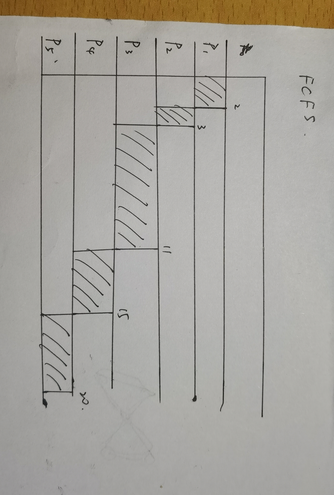
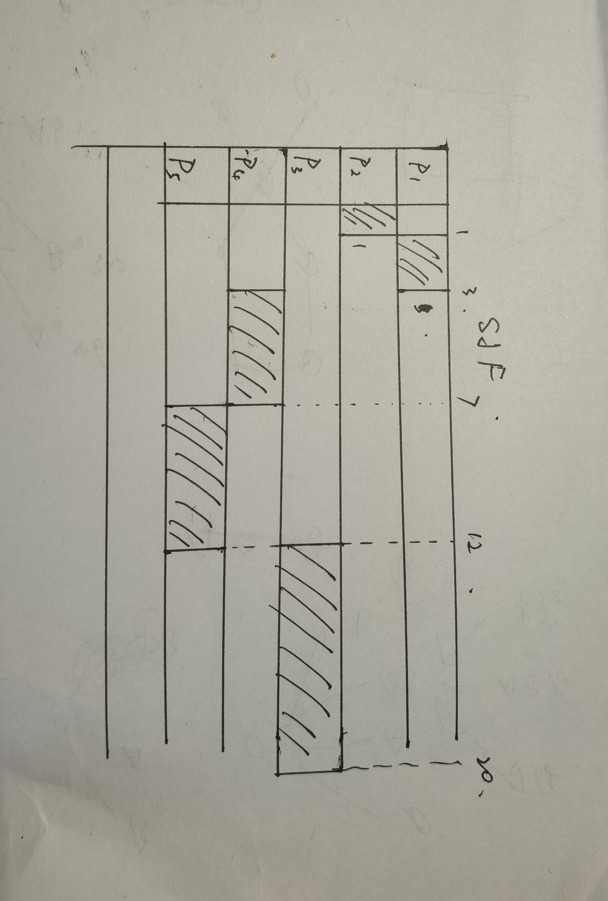
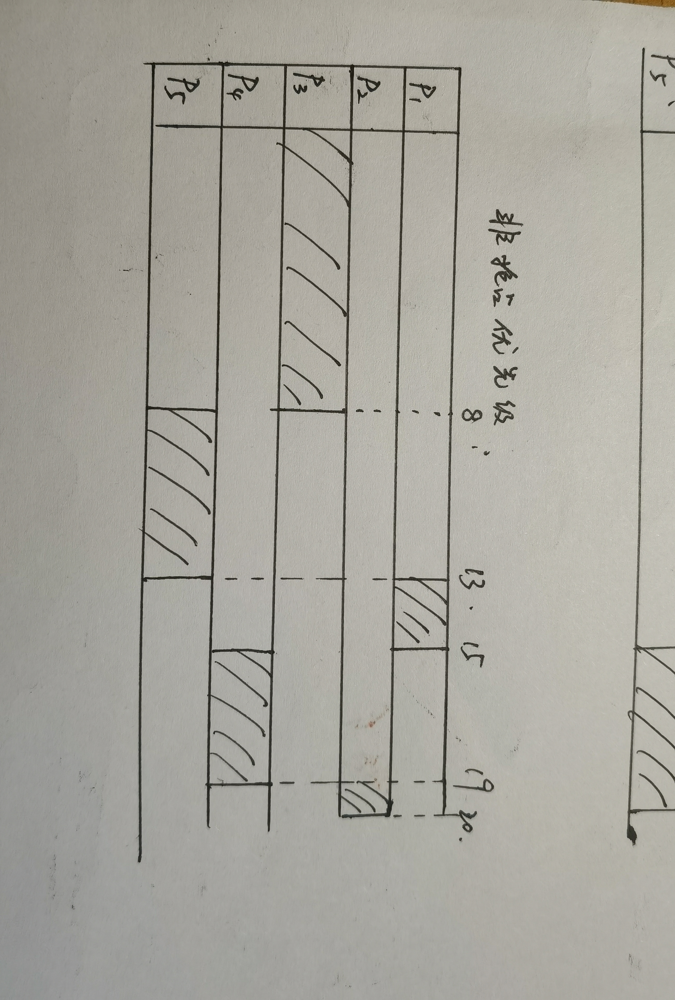
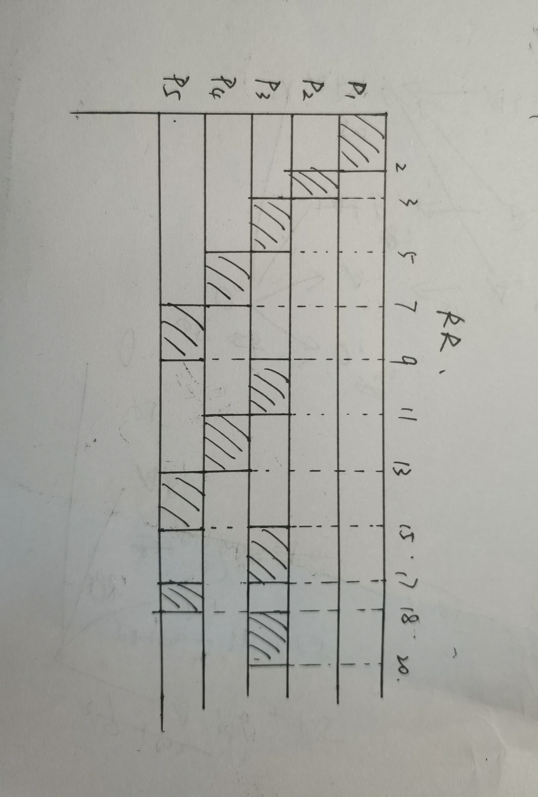

20337263俞泽斌

**3.1论述长期调度、 中期调度和短期调度的差异**  

1、短期调度程序必须经常为 CPU 选择新的进程。进程可能执行几毫秒（ ms), 就会等待 I/O 请求。  执行频率很高

2、中期调度程序的核心思想是可将进程从内存（ 或从 CPU 竞争） 中移出， 从而降低多道程序程度。之后， 进程可被重新调人内存， 并从中断处继续执行。也就是执行了交换操作      

3、长期调度程序执行并不频繁； 在新进程的创建之间， 可能有几分钟间隔。 长期调度程序控制多道程序程度 。长期调度程序
或作业调度程序 从进程保存到的大容量存储设备（通常为磁盘） 的缓冲池中选择进程， 加到内存， 以便执行。  执行频率较低


**3.7采用图 3-32 所示的程序 ， 确定行 A 、 B 、 C 、 D 中的 pid 的值。（ 假定父进程和子进程的 pid 分别为2600 和 2603。）**  

因为对于pid=fork() 对于新(子） 进程， 系统调用 fork（） 的返回值为 0; 而对于父进程， 返回值为子进程的进程标识符(非零)。  

因为A行前返回的pid=0，所以A行输出为0

因为B行前返回的pid=0，所以为子进程，由题设可得pid=2603

C行前返回的是子进程的进程标识符(非零)，所以C行输出为2603

D行因为转到的是父进程，所以getpid后的输出为父进程的pid，也就是2600


**3.8普通管道有时比命名管道更适合， 而命名管道有时比普通管道更适合。 请举例说明**  

如果一个机器中两个进程之间的通信只需要单向通信，并且当通信完成后这个管道不需要被其他进程来使用，那么普通管道更加适合

如果有多个进程需要彼此通信，并且通信完成后希望管道持续利用的，应该选择命名管道


**4.2在什么情况下， 采用多内核线程的多线程方法比单处理器系统的单线程， 提供更好的性能**  

1、当发生页面错误时，单线程进程不能有效地发挥作用。因为如果发生页面错误后，单线程的进程要么直接跳转到下一个进程，要么就挂起等待解决，不能很好地利用时间

2、对于多内核线程，当一个内核线程发生错误时，系统会采用有用的方法切换到另一个进程去使用交错时间。

所以对于可能频繁地发生错误或者等待其他系统调用事件等的情况下，采用多内核线程的多线程方法比单处理器系统的单线程， 提供更好的性能


**4.7设有一个应用， 其 60% 为并行部分， 而处理核数量分别为（ a) 2 个和（ b)4 个。 利用 Amdahl 定律， 计算加速增益。**  

(a)  1/(0.4+(1-0.4)/2)=1.43

(b)  1/(0.4+(1-0.4)/4)=1.82


**4.9具有 2 个双核处理器的系统有 4 个处理核可用于调度。 这个系统有一个 CPU 密集型应用程序运行。 在程序启动时， 所有输入通过打开一个文件而读入。 同样， 在程序终止之前， 所有程序输出结果， 都写入一个文件。 在程序启动和终止之间， 该程序为 CPU 密集型的。 你的任务是通过多线程技术来提高这个应用程序的性能。 这个应用程序运行在采用一对一线程模型的系统（ 每个用户线程映射到一个内核线程)。**
**• 你将创建多少个线程， 用于执行输人和输出？ 请解释。**

` `输入输出不存在时间上的冲突，所以一个线程就够了

**• 你将创建多少个线程， 用于应用程序的 CPU 密集型部分？ 请解释。**

4个线程，对应于4个处理核，方便调度


**5.1为什么区分 CPU 密集型程序和 I/O 密集型程序对调度程序是重要的？ **

I/O密集型在input 和output上花费了大多时间，但一般不会使用很多的CPU，而CPU密集型进程可以利用整个时间片，且不会做任何阻碍I/O操作的工作，通过给I/O密集型进程优先权和允许在CPU密集型进程之前运行，可以很好地利用计算机资源。也能让调度算法最好地发挥它的作用。


**5.7假设有如下一组进程， 它们的 CPU 执行时间以毫秒来计算**  

```
 | 进程 | 执行时间 | 优先级 |
 | ---- | -------- | ------ |
 | P1   | 2        | 2      |
 | P2   | 1        | 1      |
 | P3   | 8        | 4      |
 | P4   | 4        | 2      |
 | P5   | 5        | 3      |
```

**假设进程按 p1,p2,p3,p4,p5 顺序在时刻 0 到达。**
**a.画出 4 个 Gantt 图， 分别演示采用每种调度算法 FCFS SJF 非抢占优先级（ 一个较大优先级数值意味着更高优先级） 和 RR (时间片 =2 )) 的进程执行。**









**b.每个进程在 a 里的每种调度算法下的周转时间是多少？**

FCFS :p1 :2 ,p2: 3 ,p3: 11 ,p4: 15 ,p5: 20

SJF: p1:3 , p2: 1, p3: 20, p4: 7, p5: 12 

非抢占优先级：p1:15, p2: 20, p3: 8, p4: 19， p5:,13

RR:p1:2, p2:3, p3:20 , p4:13, p5: 18


**c.每个进程在 a 里的每种调度算法下的等待时间是多少？**

FCFS :p1 :0 ,p2: 2 ,p3: 3 ,p4: 11 ,p5: 15

SJF: p1:1 , p2: 0, p3: 12, p4: 3, p5: 7

非抢占优先级：p1:13, p2: 19, p3: 0, p4: 15, p5: 8

RR:p1:0, p2:2, p3:12 , p4:9, p5: 13

**d.哪一种调度算法的平均等待时间（ 对所有进程） 最小？**  

FCFS：（0+2+3+11+15）/ 5 = 6.2

SJF:（1+0+12+3+7）/ 5 = 4.6

非抢占优先级：（13+19+0+15+8）/ 5 = 11.0

RR:（0+2+12+9+13）/ 5 = 7.2

所以SJF最小

**6.2第一个著名的正确解决两个进程临界区问题的软件方法是由 Dekker设计的。 两个进程户。 和 A 共享以下变量：**  

**boolean flag[2]; / initially false */**  

**int turn;**

**进程P结构如下，请证明这个算法满足临界区问题的所有三个要求**

1 、互斥要求：互斥条件在flag和turn的使用中得到保证。因为如果两个进程的flag都为真，也只有turn==i的时候才会进入临界区。只有当退出临界区的时候，turn才会指向j，才能让j从等待中出来运行，同时如果j刚进入的时候设置到了turn==j的情况，那就会由flag来作为判断的信号来让临界区互斥

2、进步要求：当没有进程在临界区的时候，也就是上一个进程完成了临界区的操作的时候，他会将turn指向别的进程，同时将本进程的flag置为false，不在进行本次进程，满足进步要求

3、有限等待：如果等待了，也就是两个进程都想要进入临界区域。标志符设置都为真，那么只有turn指向的进程可以执行，其它线程处于等待状态。如果没有多个一起，那就一直重复转变turn和flag，不需要无限等待


**6.14考虑如图 6-23 所示的分配和释放进程的代码。**  

**a.指出竞争条件。**  

**b. 假设有一个名为 mutex 的互斥锁， 它有操作 acquire（） 和 release（）。 指出应在哪里加锁,以便防止竞争条件。**
**c.能否采用原子整数**
**int number _of.processes = 0**
**来取代整数**
**atomic.t number_of.processes**  

**以防止竞争条件？**  

a、int allocate_process() 和 void release_process()这两个函数共享了变量number.of.processes。所以两个函数一起对这个变量进行竞争，失败的一方后执行，也会决定了这个变量的最终值。

b、对于int allocate_process()，进入时直接先调用acquire()，退出的时候调用release();

对于void release.process()，在     --number.of.processes   前面调用acquire(),在这一行的后面调用release()

c、不行，因为竞争条件后的容易使得number.of.processes  大于255，从而使进程结束


**7.1考虑如图 7-10 所示的交通死锁。**
**a.证明这个例子实际包括死锁发生的 4 个必要条件。**
**b.给出一个简单规则， 以便避免系统死锁**  

a、互斥 ：一辆车占据一个位置，不能重叠

​      占有并等待：每辆车都占据着位置，等待前面的车动

​      非抢占：每一辆车都不能直接离开，不能传出去

​       循环等待：每一辆车都等着前面的车动

b、每个路口都设置红绿灯，同时横向与纵向的绿灯时间相同


**7.12假设一个系统具有如下快照**

```
|      | Allocation（ABCD） | Max（ABCD） |
| ---- | ------------------ | ----------- |
| P0   | 3014               | 5117        |
| P1   | 2210               | 3211        |
| P2   | 3121               | 3321        |
| P3   | 0510               | 4612        |
| P4   | 4212               | 6325        |

```

**采用银行家算法，确定如下每个状态是否安全的，如果状态是安全的，那么说明进程可以完成的顺序。否则，说明为什么状态是不安全的。**  

**a. Available = （0，3，0，1）** 

**b. Available = （1，0，0，2）**

对于a状态

先计算need =max-allocation

```
|      | Allocation（ABCD）  | Max（ABCD）  | Need(ABCD) |
| ---- | ------------------ | ----------- | ----------  |
| P0   | 3014               | 5117        | 2 1 0 3     |
| P1   | 2210               | 3211        | 1 0 0 1     |
| P2   | 3121               | 3321        | 0 2 0 0     |
| P3   | 0510               | 4612        | 4 1 0 2     |
| P4   | 4212               | 6325        | 2 1 1 3	    |
```

现在的available为0301，首先选择p2，满足，此时available更新为3422

然后选择p1，满足，available更新为5632

然后选择p3，满足，available更新为5 11 4 2

后面发现p0和p4的need中的D都大于available，所以不安全

对于b状态

现在的available为1002，首先选择p1，满足，此时available更新为3212

然后选择p2，满足，available更新为6333

然后选择p3，满足，available更新为6840

然后选择p0，满足，available更新为9854

最后选择p4，满足

所以b状态是安全的


**7.14 死锁检测算法的乐观假设是什么？如何违反这个假设？**

  乐观假设是在资源分配和进程请求资源中，不存在循环等待

违反，只要在资源分配和进程请求资源中，发生循环等待即可
