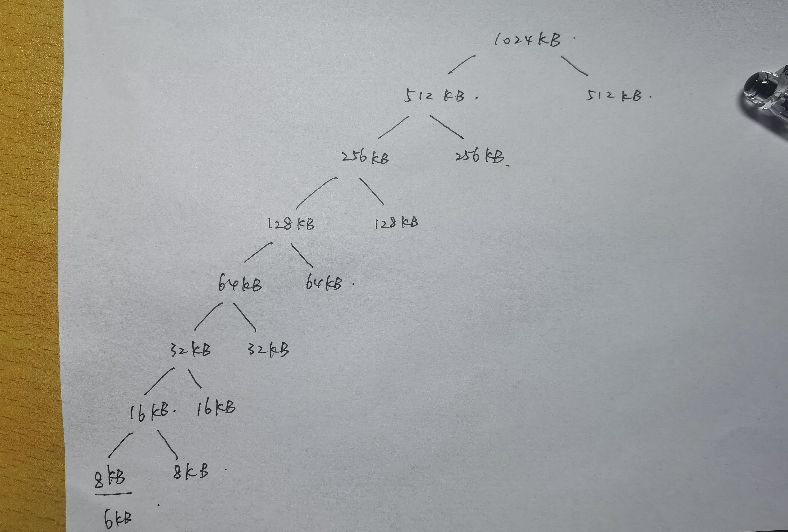
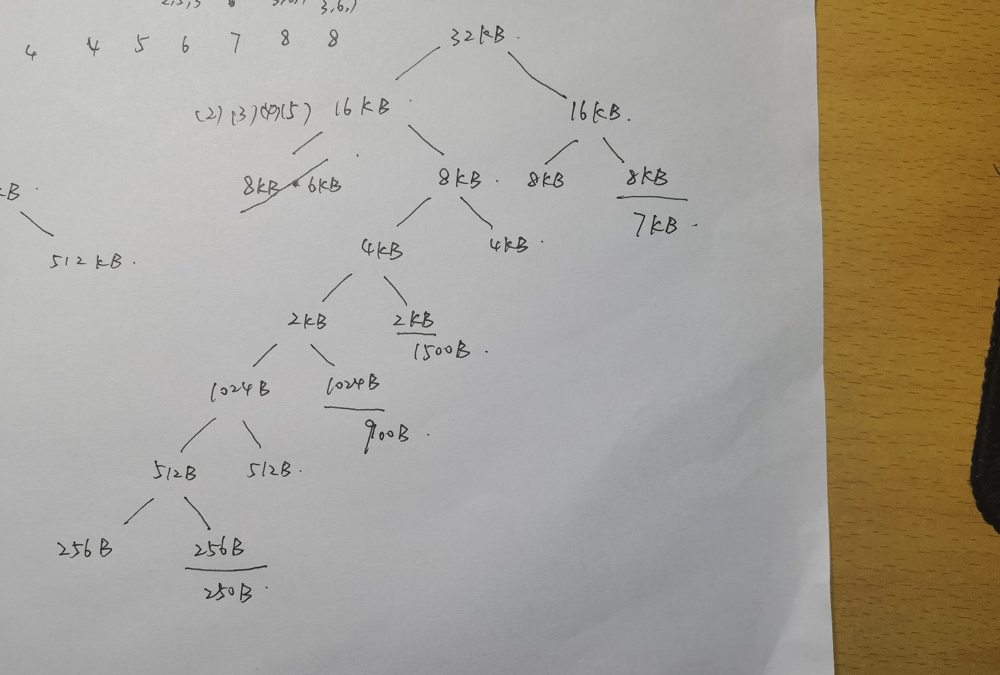
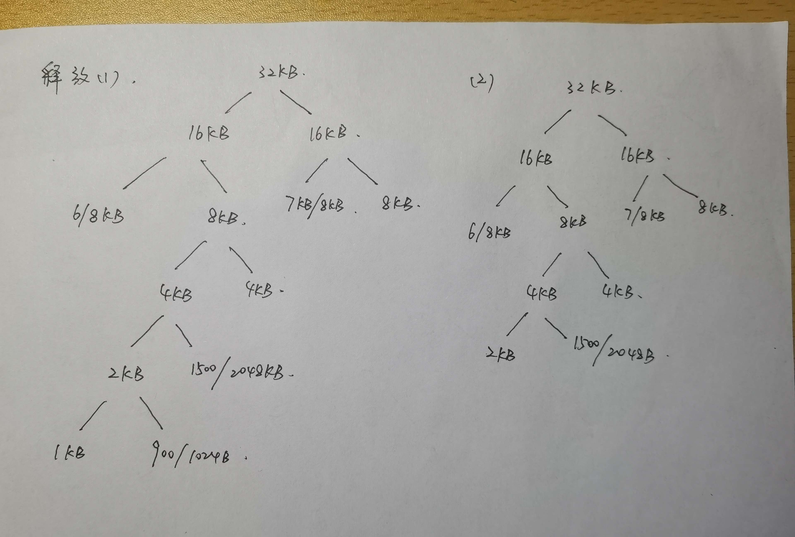
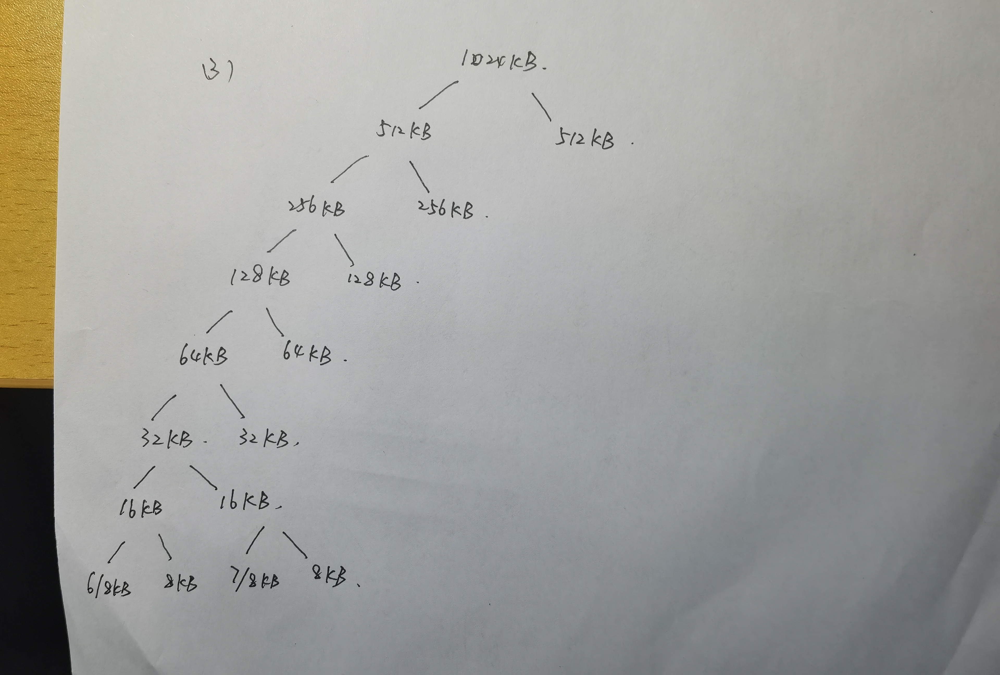

20337263俞泽斌

第八章
8.3、给定 6 个内存分区： 300KB 、 600KB 、 350KB、 200KB、 750KB 和 125KB (按顺序)， 分别采用
首次适应、 最优适应 、 最差适应算法， 如何放置大小分别为 115KB 、 500KB、 358KB、 200KB 和
375KB (按顺序） 的进程？ 根据它们使用内存的效率对算法进行排序。  

答:具体分区内部放置的进程如下表

```
首次适应        | 115 | 500 | 200 | 空  | 358、375 | 空  |
最优适应        | 空  | 500 | 空  | 200 | 358、375 | 115 |
最差适应        | 空  | 358 | 200 | 空  | 115、500 | 空  |
```

发现最差适应无法安排375大小的进程

内存使用效率：最优适应>首次适应>最差适应


8.6、对于分页系统， 进程无法访问它所不拥有的内存。 为什么？ 操作系统如何才能允许访问其他的内存？ 为什么应该或不应该？  

答：因为每个进程都拥有自己的页表，当用户开始使用逻辑地址来访问内存的时候，只会使用自己的页表进行查询，自己的页表项是通过操作系统分配给的地址来决定的。而不在自己的页表项内的内存无法使用或者说访问到。

​	    如果操作系统所有的页表都直接放在一起，能被每一个进程所看到和访问到，那么每个进程就可以访问其他的内存。或者分配给进程内存地址的时候修改基地址寄存器和界地址寄存器来允许进程访问其他的内存

​		不应该让进程访问他不拥有的内存，这样可能会导致内存被修改，引发其他的安全性问题。


8.12、假设页大小为 1 KB, 以下地址引用（以十进制数形式提供） 的页码和偏移量是多少：
a.3085
b.42 095
c.215 201
d.650 000
e.2 000 00 1

答：1kb=1024b，所以将每个树整除1024得到页码，mod1024得到偏移量

```
a.页码：3   |偏移量：13
b.页码：41  |偏移量：111
c.页码：210 |偏移量：161
d.页码：634 |偏移量：784
e.页码：1953|偏移量：129
```


8.17、假设有一个分页系统， 它的页表在内存中。
a.如果内存引用需要 50ns, 分页内存的引用需要多长时间？
b.如果添加了 TLB, 并且所有页表引用的 75% 可在 TLB 中发现， 那么内存引用的有效时间是多少？（ 假设所查的页表条目在 TLB 中时， 需要 2ns)。

答：a、分页内存的引用需要使用两次内存引用，所以需要100ns

b、有效时间=75% *(2ns+50ns)+25% *(50ns+50ns+2ns)=64.5ns


8.20、 假设有下面的段表： 以下逻辑地址的物理地址是多少？ 

```c
段 基地址 长度
0 219 600
1 2300 14
2 90 100
3 1327 580
4 1952 96
a.0430
b.110
c.2500
d.3400
e.4112
```

答：第一位为段号，后面为偏移量

```c
a.  219 + 430 = 649
b. 2300 + 10 = 2310
c.  500 > 100，超出地址范围，错误
d.  1327 + 400 = 1727
e.  112 > 96，超出地址范围，错误
```


8.23、比较一下在处理大型地址空间时的分段分页方法与哈希表方法。 在什么环境下， 哪一种更合适？  

答：分段方法能更好的满足用户的需要，方便对内存的管理和访问，但是容易产生内存碎片

分页的方式更多是由于系统管理的需要，不容易产生内存碎片，但是要查表会造成时间的增加。

哈希表的方式能够让访问地址空间更大的更加便捷

处理大于 32 位地址空间的常用方法是使用哈希页表  ，处理32位地址空间的时候还是用分段分页的方法


第九章

9.1、假设程序刚刚引用了虚拟内存的一个地址。 描述可能发生以下每个情况的情景。 （ 如果不可能发生， 解释为什么。）
• TLB 未命中， 没有缺页错误。
• TLB 未命中， 有缺页错误。
• TLB 命中， 没有缺页错误。
• TLB 命中， 有缺页错误。  

答：1、可能发生，说明该页表项不在TLB中但是在内存中

​        2、可能发生，说明该页表既不在TLB中又不在内存中

​		3、可能发生，说明该页表项已经在TLB中了，可以直接访问了

​		4、不可能发生，因为既然TLB命中了，说明已经找到对应的页表项了，内存中肯定有这页，就不会发生缺页错误。


9.6、假设采用请求调页的内存。 页表保存在寄存器中。 如果有可用空帧或者置换的页面未被修改， 则缺页错误的处理需要 8ms; 如果置换的页面已被修改， 则需要 20ms。 内存访问时间为 100ns。假设需要置换的页面在 70% 的时间内会被修改。 对于有效访问时间不超过 200ns. 最大可接受的缺页错误率是多少？  

答：设缺页错误率为p，那么有效访问时间就是 p(100ns+8ms * 30%+20ms * 70%)+(1-p)*100ns 需要<200ns

计算得p的最大值约为 0.000609%


9.8考虑下面的页面引用串： 7,2,3,1,2,5,3,4,6,7,7,1,0,5,4,6,2,3,0,1

假设采用3个帧的请求调页，以下置换算法会发生多少次缺页错误？ 

```
LRU: 18

|  7   | 7 miss    
|  2   | 7 2 miss 
|  3   | 7 2 3 miss 
|  1   | 2 3 1 miss 
|  2   | 3 1 2 hit   
|  5   | 1 2 5 miss  
|  3   | 2 5 3 miss  
|  4   | 5 3 4 miss  
|  6   | 3 4 6 miss 
|  7   | 4 6 7 miss  
|  7   | 4 6 7 hit   
|  1   | 6 7 1 miss 
|  0   | 7 1 0 miss 
|  5   | 1 0 5 miss  
|  4   | 0 5 4 miss 
|  6   | 5 4 6 miss
|  2   | 4 6 2 miss
|  3   | 6 2 3 miss
|  0   | 2 3 0 miss 
|  1   | 3 0 1 miss 
```

```
FIFO: 17

|  7   | 7     miss   
|  2   | 7 2   miss  
|  3   | 7 2 3 miss  
|  1   | 2 3 1 miss  
|  2   | 2 3 1 hit   
|  5   | 3 1 5 miss 
|  3   | 3 1 5 hit   
|  4   | 1 5 4 miss
|  6   | 5 4 6 miss  
|  7   | 4 6 7 miss  
|  7   | 4 6 7 hit   
|  1   | 6 7 1 miss   
|  0   | 7 1 0 miss
|  5   | 1 0 5 miss
|  4   | 0 5 4 miss 
|  6   | 5 4 6 miss
|  2   | 4 6 2 miss
|  3   | 6 2 3 miss
|  0   | 2 3 0 miss
|  1   | 3 0 1 miss
```

```c
 OPT: 13

|  7   | 7     miss    
|  2   | 7 2   miss 
|  3   | 7 2 3 miss 
|  1   | 1 2 3 miss 
|  2   | 1 2 3 hit   
|  5   | 1 5 3 miss  
|  3   | 1 5 3 hit   
|  4   | 1 5 4 miss 
|  6   | 1 5 6 miss  
|  7   | 1 5 7 miss  
|  7   | 1 5 7 hit   
|  1   | 1 5 7 hit
|  0   | 1 5 0 miss 
|  5   | 1 5 0 hit   
|  4   | 1 4 0 miss
|  6   | 1 6 0 miss
|  2   | 1 2 6 miss 
|  3   | 1 3 6 miss
|  0   | 1 3 6 hit   
|  1   | 1 3 6 hit
```


9.18、假设有一个请求调页系统具有一个平均访问和传输时间为 20ms 的调页磁盘。 地址转换是通过内存中的页表来进行的， 每次内存访问时间为1ms。 因此， 通过页表的每次内存引用需要两次访问。 为了改善这一时间， 添加了一个关联内存； 如果页表条目处在关联内存中， 则可以减少内存引用的访问时间。 假设 80% 的访问在关联内存中进行， 剩余的 10% (或总数的 2%) 会导致缺页错误。 有效的内存访问时间是多少？  

答：有效的内存访问时间： 0.8 * 1ms + 0.18 * 2ms + 0.02 * 20ms = 1.56 ms


9.19、抖动的原因是什么？ 系统如何检测抖动？ 一旦系统检测到抖动， 它可以做什么来消除这个问题？  

原因：如果进程没有需要支持活动使用页面的帧数， 那么它会很快产生缺页错误。 此时， 必须置换某个页面。 然而， 由于它的所有页面都在使用中， 所以必须立即置换需要再次使用的页面。 因此， 它会再次快速产生缺页错误， 再一次置换必须立即返回的页面， 如此快速进行  

系统通过检测缺页错误率来检测抖动

可以设置所需缺页错误率的上下限 ，将一些进程交换到磁盘来减少对内存的消耗


9.22在 1024KB 段中， 采用伙伴系统分配内存。 利用图 9-26 作为指南， 绘制一棵树， 说明如何分配
以下内存请求：
• 请求 6KB
• 请求 250 字节
• 请求 900 字节
• 请求 1500 字节
• 请求 7KB
接下来， 根据以下内存释放来修改生成树。 尽可能执行合并：
• 释放 250 字节
• 释放 900 字节
• 释放 1500 字节  







