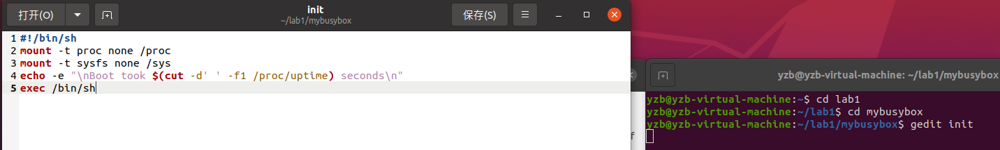
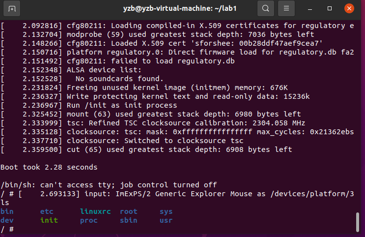

**操作系统原理 实验一**

## 个人信息

【院系】计算机学院

【专业】计算机科学与技术

【学号】20337263

【姓名】俞泽斌

## 实验题目

编译内核/利用已有内核构建OS  

## 实验目的

1. 熟悉现有Linux内核的编译过程和启动过程， 并在自行编译内核的基础上构建简单应用并启动。
2. 利用精简的Busybox工具集构建简单的OS， 熟悉现代操作系统的构建过程。
3. 熟悉编译环境、相关工具集，并能够实现内核远程调试。

## 实验要求

1. 搭建 OS 内核开发环境包括：代码编辑环境、编译环境、运行环境、调试环境等。
2. 下载并编译 i386（32位）内核，并利用 qemu 启动内核。
3. 熟悉制作 initramfs 的方法。
4. 编写简单应用程序随内核启动运行。
5. 编译i386版本的 Busybox，随内核启动，构建简单的 OS 。
6. 开启远程调试功能，进行调试跟踪代码运行。
7. 撰写实验报告。

## 实验方案

&emsp;&emsp;一开始的操作就是下载一个VMware软件，然后在其中配置了一个Ubuntu的虚拟机，进行一系列常规的分辨率和语言改动之后进入正题
&emsp;&emsp;首先是对于下载速度的升级了，换成了aliyun的镜像来提高下载速度，也就是在/etc/apt/sources.list里加入了阿里云的一些链接，也是从网上复制过来的，然后按照tutorial里的操作步骤，进行c++环境的配置，并且通过命令行的各种操作，安装上各种必要软件比如qemu，nasm等等，Ubuntu20.04版本的nasm似乎是2.14的，与tutorial里的nasm2.15有所出入，但是在后续实验中好像没有大的影响。
&emsp;&emsp;接下来就是内核的下载和配置，首先从Linux下载内核到lab1文件夹，然后经过解压等一系列操作，将内核编译成i386 32位版本并编译内核，检查Linux压缩镜像linux-5.10.19/arch/x86/boot/bzImage和符号表linux-5.10.19/vmlinux是否已经生成
&emsp;&emsp;然后是gdb调试的步骤:使用qemu启动内核并开启远程调试。在另外一个Terminal下启动gdb，并在gdb下，加载符号表，在gdb下，连接已经启动的qemu进行调试，再通过设置断点并运行。
&emsp;&emsp;之后进行制作Initramfs，先在lab1下写一个简单的helloworld文件，然后将文件保存在~/lab1/helloworld.c中，然后将上面代码编译成32位可执行文件。用cpio打包initramfs。启动内核，并加载initramfs。
&emsp;&emsp;最后是编译并启动Busybox，从Busybox官网下载Busybox到/lab1，然后解压。这里采用的是busybox1.33.2的版本，也与tutorial里的有所出入，但是影响不大，接着按照tutorial进行一些设置，并进行编译，最后制作Initramfs将安装在_install目录下的文件和目录取出放在~/lab1/mybusybox处。initramfs需要一个init程序，可以写一个简单的shell脚本作为init。用gedit打开文件init。加上执行权限并将x86-busybox内容打包归档成cpio文件，以供Linux内核做initramfs启动执行。最后加载busybox，即可用ls命令。

包括：硬件或虚拟机配置方法、软件工具与作用、方案的思想、相关原理、程序流程、算法和数据结构、程序关键模块，结合代码与程序中的位置位置进行解释。不得抄袭，否则按作弊处理。

## 实验过程

&emsp;&emsp;这里就是有关于源的改变了，我采用的是阿里云的镜像来提高下载速度。其实一开始想用的是清华源，也是老师在教程里面所推荐的，但是换源的时候出现了找不到release文件的报错，当时上网查就直接换成阿里云了，后来在群里的讨论下才发现就是http和https的区别

这是sudo&emsp;apt&emsp;update命令后的运行截图，可以看到源换成功了，也输出了一些过程

gcc-v的命令，可以看到最后输出了gcc的版本号&emsp;gcc&emsp;version&emsp;9.4.0,也就是表明gcc已经安装成功，c语言环境已经配置完成。

这里将内核编译成i386 32位版本，也就是tutorial中所提到的选项操作，选完后保存退出

helloworld的c代码，有关gdb调试的那部分，因为后文中有直接使用代码进行调试的，比开始这里的直接调试并未输出结果的更有效果，所以这里不加赘述

可以看到helloworld.c文件已经被编译成了可以执行的文件，因为一开始第一次进行编译的时候没有截图，所以这里就不放控制台终端的截图了，转而用的是文件夹中的截图，也可以看出里面存在了编译后的文件

这里就采用了用cpio打包initramfs和启动内核，并加载initramfs的操作步骤，其实主要注意的还是有关于linux版本号的区别，后面的都是照抄

这是gdb调试界面，也是按照tutorial里的直接进行操作，后面可以看到在另一个终端页面，也就是initramfs的加载页面出现了helloworld的界面

这里就第一个任务完成了

加载busybox的有关开始的一些步骤，因为第一次做的时候没有截图，就放上来一个选择文件夹里的截图，可以看到busybox的安装以及制作Initramfs并把它命名为mybusybox的生成都是成功了的

shell脚本的主要内容，第一行一开始没有加上就导致后面一直出现cannot&emsp;find&emsp;the&emsp;dictionary的情况（虽然出现了那种情况之后只要ls命令输入得够快也可以出现文件夹）但是加上这一行之后就不再一直刷屏cannot&emsp;find&emsp;the&emsp;dictionaryl。也可以正常地输入ls命令显示文件夹

这是将x86-busybox下面的内容打包归档成cpio文件，以供Linux内核做initramfs启动执行后的终端界面，也可以看到是成功的

最后的操作，也就是加载busybox，加载了之后再输入ls命令，可以看到输出了其中所有的文件夹，说明busybox加载成功

包括：主要工具安装使用过程及截图结果、程序过程中的操作步骤、测试数据、输入及输出说明、遇到的问题及解决情况、关键功能或操作的截图结果。不得抄袭，否则按作弊处理。

## 实验总结

&emsp;因为大部分的实验操作都是按照tutorial里面写的步骤来做的，所以可能理解上来说并没有特别的突出，第一次遇到的问题就是清华源的换源问题，其实上次不知道什么时候好像是给我的虚拟机换源过的，但是还是忘记掉了，一开始跟着tutorial里的步骤去做，发现存在报错是没有release文件，当时也不知道这报错是什么意思，上网查到可以换成阿里云，也就直接复制了，并未深究，后来看群里的发言才知道https应该改成http，这是其一。
&emsp;然后是关于选项界面的操作，一开始还不太会用，后来慢慢理解和发现了这些选项的使用方式。对于内核的下载和编译来说，一开始也就是直接把tutorial里的代码复制过来，后来明白是把linux内核编译成i386的形式，来通过指令对一些程序进行操作。其实还有个比较小的方面是关于文件的解压，linux里的解压方式就是将文件的后缀名一个一个提到前面来进行解压，也是一件比较有趣的事情，主要就是linux内核的解压和后面busybox的解压两个方面了。同时我还学习了怎么在命令行界面下采用gdb调试，也就是在两个终端下进行编译和运行操作，也是一个比较新奇的体验
&emsp;制作Initramfs的方面，我也熟悉了基本的使用命令行以及 linux内核来调试和运行的步骤在lab1下写一个简单的helloworld文件，文件保存在helloworld.c中，然后将上面代码编译成32位可执行文件。用cpio打包initramfs。启动内核，并加载initramfs。同时我还学习了怎么在命令行界面下采用gdb调试，也就是在两个终端下进行编译和运行操作，也是一个比较新奇的体验
&emsp;最后还有一个方面是关于shell文件的，一开始进行是按照tutorial里的文件直接复制的，后来在编译之后将要输入ls命令的前一步的时候发现一直刷屏出现cannot&emsp;find&emsp;the&emsp;dictionary的情况，后来在查找网上资料以及看群里助教回复的方法下才改掉了shell文件，并且成功实现了最后的ls命令查看所有文件夹。

每人必需写一段，文字不少于500字，可以写心得体会、问题讨论与思考、新的设想、感言总结或提出建议等等。不得抄袭，否则按作弊处理。

## 参考文献

~/tutorial
https://blog.csdn.net/m0_52672980/article/details/122315063?ops_request_misc=%257B%2522request%255Fid%2522%253A%2522164584290216781685366185%2522%252C%2522scm%2522%253A%252220140713.130102334..%2522%257D&request_id=164584290216781685366185&biz_id=0&utm_medium=distribute.pc_search_result.none-task-blog-2~all~sobaiduend~default-1-122315063.pc_search_insert_es_download&utm_term=ubuntu20.04%E6%B2%A1%E6%9C%89release%E6%96%87%E4%BB%B6&spm=1018.2226.3001.4187