**操作系统原理 实验二**

## 个人信息

（此部分需补充完整）

【院系】计算机学院

【专业】计算机科学与技术

【学号】20337263

【姓名】   俞泽斌

## 实验题目

计算机开机启动及中断调用

## 实验目的

1. 熟悉计算机开机过程并编写代码。
1. 熟悉操作系统中断机制，通过汇编语言进行实现。
2. 掌握基础汇编语言，可以使用汇编语言写简单的程序。
3. 掌握处理器寻址方式。
4. 掌握常用的寄存器用法。
5. 熟练掌握qemu+gdb调试方法。

## 实验方案

​	首先第一个任务就是将一开始给的代码里的hello world改成学号了，也就是在每一个字符上面去操作，然后修改一下gs里面的几个数字代表xy坐标

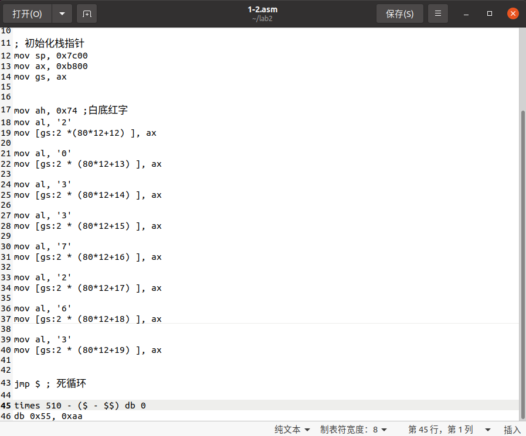

​	2.1的实验上，主要的操作是对于int10h 的使用方面了，当ah=2h的时候可以设置光标的位置，然后ah=3的时候获取光标的位置然后输出，这里要注意的就是在于获取光标的位置得到的ASCII码，所以要作为输出的话需要加上48得到字符

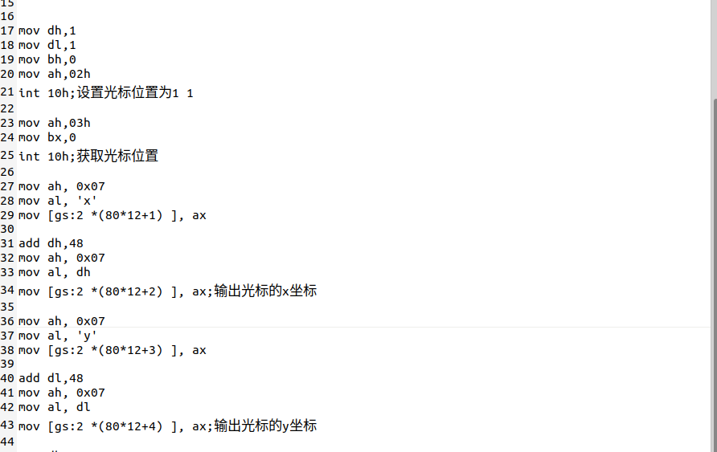

​	2.2的实验，其实主要也是int10h的操作上了，首先用ah=2h设置光标位置为1,1，然后在对于每一个需要输出的字符来说，光标的x轴坐标加一，然后调用ah=09h的方法，将要输出的单个字符运到al寄存器上然后调用int10h输出,这里截取的主要是位置和颜色的设置和第一第二位学号，因为后面的都是第二位这一个操作，就是将引号中的数据改动了一下。

​	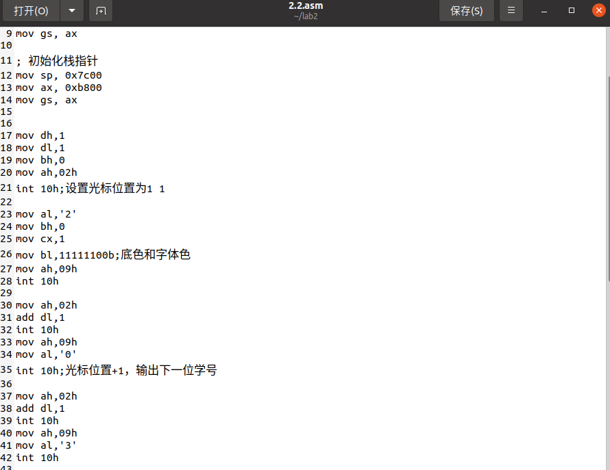

​	2.3的实验，主要是一个循环了，是调用了int16h来监控输入了什么数据，然后通过ah=0eh，int10h来对监控到的输入，也就是放在寄存器中的字符进行输出

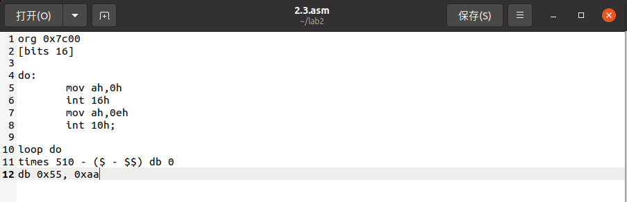

​	3的3个实验主要是在于对汇编语言的学习方面了，第一个your_if其实主要还是仿照老师写好的l1就可以了，如果没有给l1的话可能还会在获取a1和a2的方面存在错误，就是将寄存器和数组联系起来的方面需要注意，

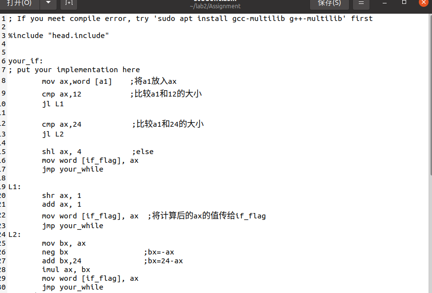

第二个your_while主要就是一个循环了，就是在循环的开头将a2读出来，然后和12进行比较，如果小于12的话就直接jmp到下一个环节，这里要注意的是不能直接跳转到your_while，否则会漏掉中间的#include"end.include"从而导致调试的时候出现段错误，然后至于循环内部的问题就是在于位数要匹配，多用几个寄存器的事情就好了，

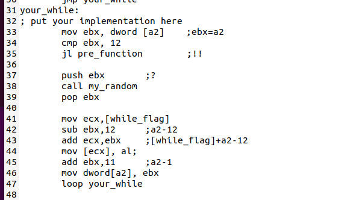

第三个your_function主要的问题也是在于对循环条件的判断上，直接可以判断读出的那位是不是0，不需要加上引号，因为字符串的最后一位就是ASCII码的0，然后ebx不断++，ecx为数组首地址，然后调用print函数一个个字符输出就可以了

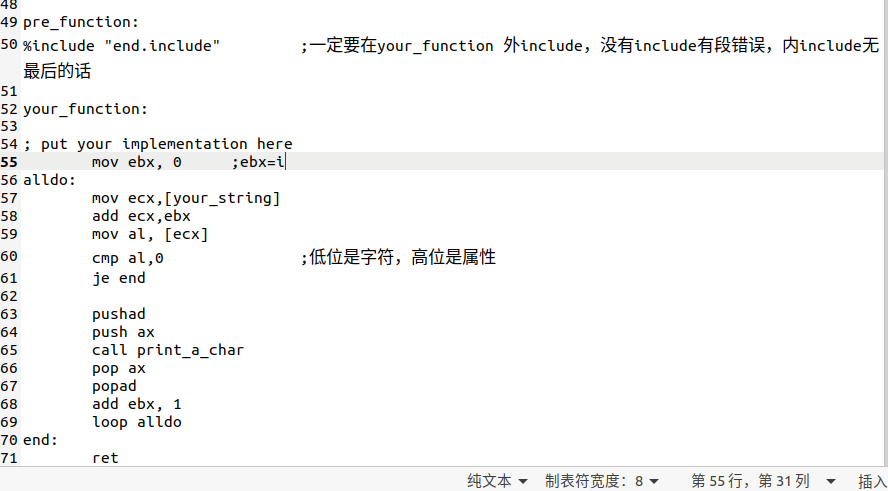

​	4的实验上主要有两个需要变化的地方，首先是关于数字和颜色的变化也就是两个循环，每一次循环的时候进行比较大小，如果数字超过了9，就用num_reset进行重置为0，同理如果颜色超出了固定的范围也重置，但因为颜色的操作是十位和个位一起变化才能实现前景色和背景色一起变化的感觉，所以都一起进行操作

(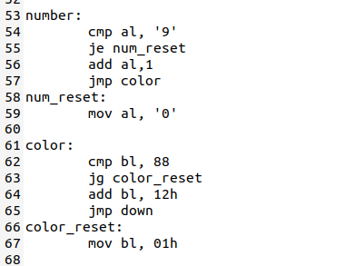)

​	第二个需要注意的变化就是在于对于这个线条的遇到墙壁的反射方面了，主要的操作其实是在于对于这个光标的左右上下的位置移动方面的，因为一开始的操作都是向右下45度的方向进行射出，首先我设定了两个di和si来作为向上向下和向左向右的判断链接，所以第一个循环我采用的是down，也就是向下的操作，一开始我用int10h的设置的画布是80*25的，坐标原点在左上角，所以当然如果di为-1的时候是直接跳转到up的循环内的，down里的循环结束判断条件是在dh>25的时候进入下一个right也就是向右的循环，然后将di设置为-1，将循环进入right里，right的第一步也是判断si是不是为-1，是的话跳转到left里，同理在left和up里面也有判断是否di和si为1的情况，如果是的话就立马跳转到right和down里，right循环的判断条件是dl>80，left是dl<0,up也是dh<0，后来为了留两行给姓名和学号的输出我就将up的循环条件判断改成了dh<2，当然以上的循环条件判断都是在经过了+1或者-1处理后再进行判断的，也就是判断的是下一位，所以如果超出了循环条件后，再跳转的时候还要将原来的坐标计算回来，也就是-1或者+1

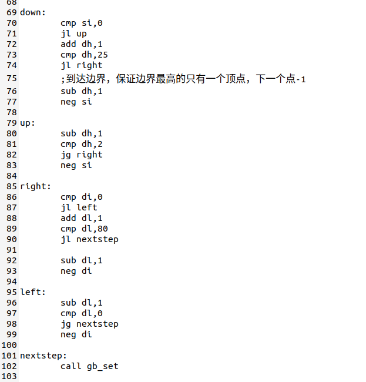

​	为了尽量简单的加点创新，我用的两端射入的方式就是从左边的整个图像进行了整个的对称，所以我在print的后面，也就是循环里面加上了print_duichen的操作，也就是在print后加上了寻找这个坐标的对称点的操作，并且将它封装起来，然后在print_duichen里面在call find_duichen操作来重新得到原来的坐标，再进行上述的循环操作找到下一个坐标。

​	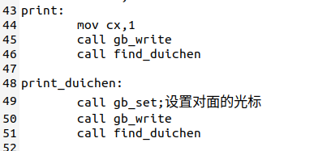

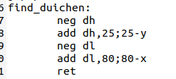

​	然后因为调用的操作比较多，所以在后面我就把所有的光标设置和光标位置写入的操作全都用函数进行了封装，简单化了在里面的调用操作，也写起来比较方便，在输出学号和姓名拼音的那一个方面，我一开始采用的是2.2的操作，也就是在设置光标位置后然后在光标位置写入一个字符，一次一次的去写，后来上网发现可以直接写入字符串，那原来的这个函数就保留下来了，同时写入字符串也比较方便，在下一部分也一样。

​	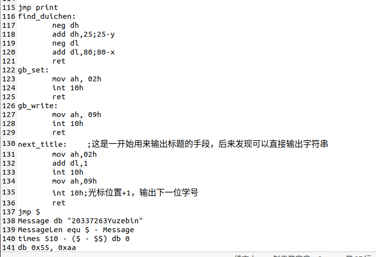

最后就是在上面输出字符串的操作了，主要也就是采用了网上的代码，调用ah=13h的int10h中断来实现

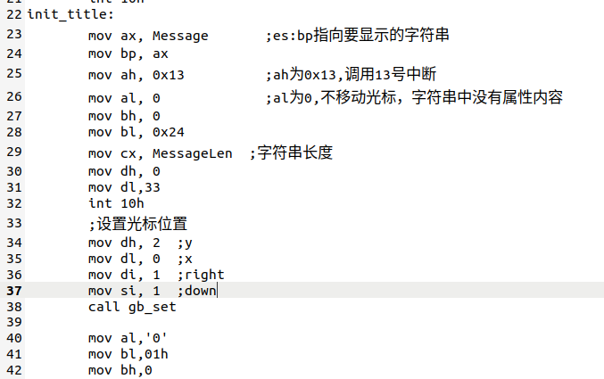

​	5的实验更多是一个拼接的过程，其实主要的代码也就比4多了下面的一段，主要内容是两个字符串的实现，也就是两个ah=13h的int10h，用来输出学号姓名以及下面的Press any key to start的操作，另一个是int16h的使用了，使用后监控键盘，键盘如果有输入，那al就不等于0，就可以跳转到下一个界面，也就是4的界面。

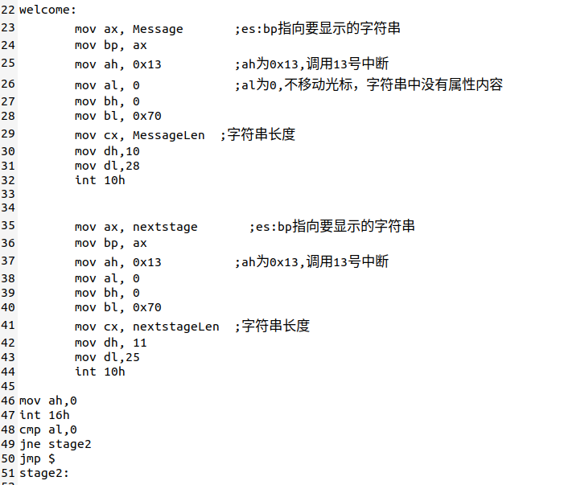

包括：硬件或虚拟机配置方法、软件工具与作用、方案的思想、相关原理、程序流程、算法和数据结构、程序关键模块，结合代码与程序中的位置位置进行解释。不得抄袭，否则按作弊处理。

## 实验过程

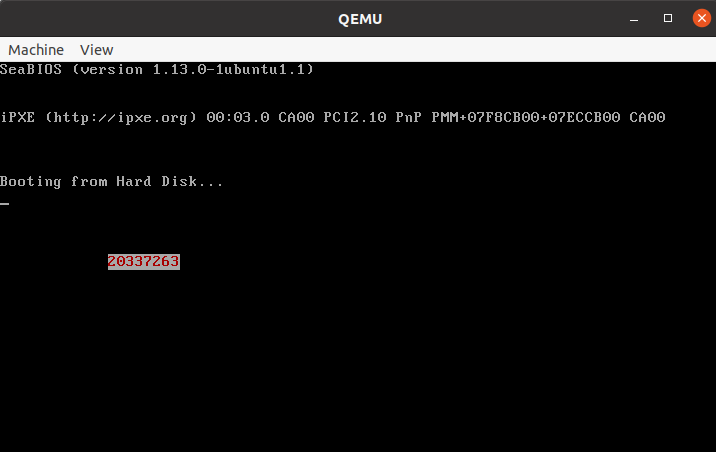

​	这是1-2的输出，这里主要改动了helloworld的代码，就是改动其中的x轴和y轴，并且改变了字符

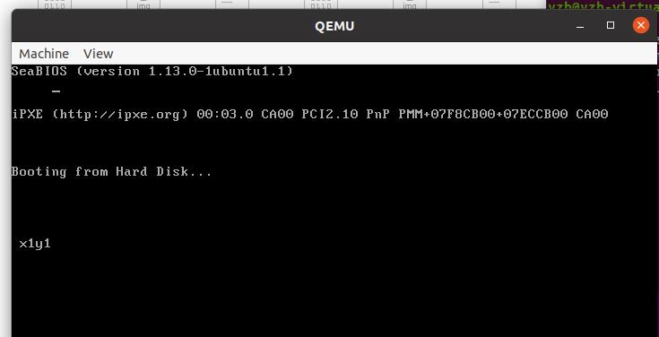

​	这是2.1的输出，也就是读取光标的位置并输出，一开始在做这个程序的时候输出发现是两个类似于笑脸之类的非法字符，后来才发现是对应的ASCII所对应的符号，最后也就是在dh和dl后面加上了48就输出了正常的结果了。

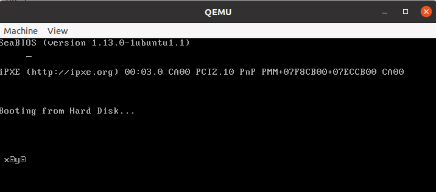

这里是没有加上48的结果，可以看到输出的是两个类似于笑脸之类的非法字符

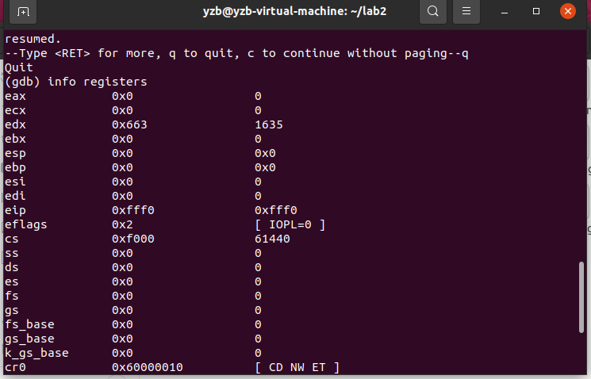

​	通过gdb调试的查看寄存器的值的功能，可以看到dh和dl的值，是ASCII码下的11

​	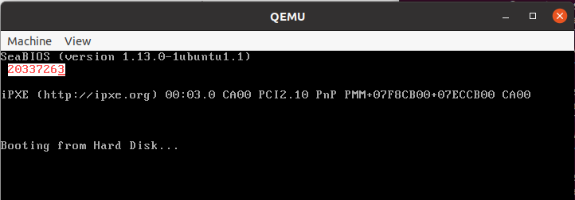

​	这是2.2的输出，也就是通过的光标移动和在光标位置输出字符的办法，一个一个数字进行输出，后来发现了可以输出整个字符串的方法，然后就在4中使用的字符串输出的办法，这里的代码还是最原始的，也没有包装成函数，就比较繁杂。

​	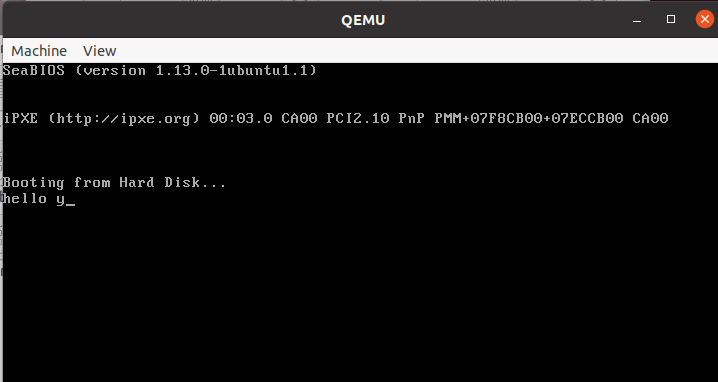

​	2.3这里主要是通过int16h读取键盘上输入的内容，然后通过int10h来输出，放在寄存器中的字符进行输出，主要就是一个死循环的方面，让每一个字符都进行输入和输出，可能还缺的就是int 16h有些键位不是很支持

​	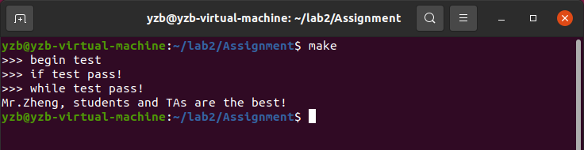

​	这是3的成功输出，但是其中的时候还碰到一个问题是段错误，后来通过排查发现是代码中跳过了中间的#include"end.include"，所以在your_function 前加上pre_function 来避免出现这个错误

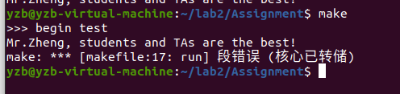

​	如果出现gdb调试权限不够可以加入chmod777

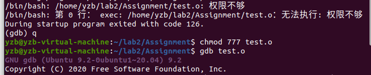

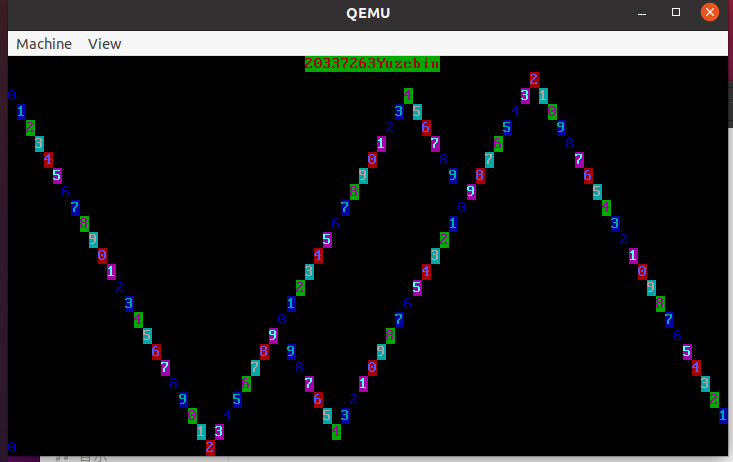

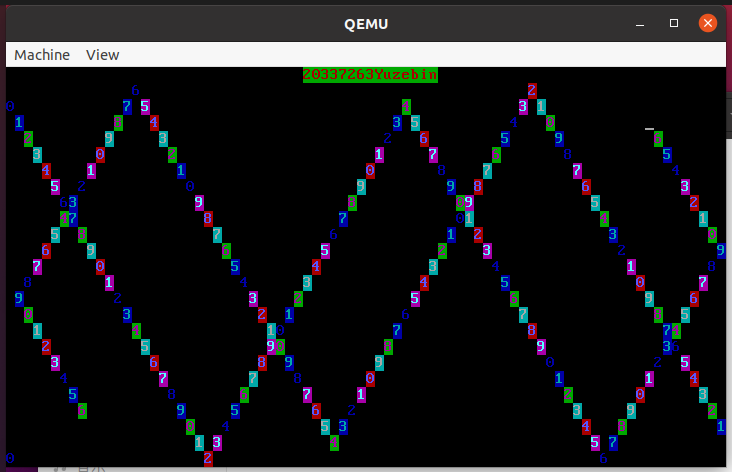

​	这是4的运行结果，不想录动态的了就放了两张图片，可以看到发射以及反弹 都是没有问题的，其实后来发现如果为了让这些线条避开中间的学号加姓名，也就是将前两排让开，将运行的判断条件改为cmp dh 2，后因为右边的图像是完全对称左边的，所以左边无法到达上面两行，右边就无法到达下面两行，不过都是正常的反弹，也可以接受。

​	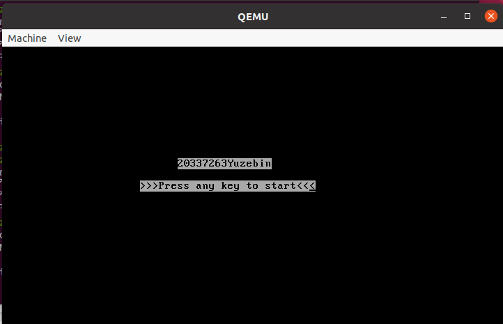

​	5的初始界面，后来通过int16h的对键盘监控来跳转到下一个界面，这里使用的也是字符串的输出，也是将4的代码分块地拷贝过来，点击任何键之后进入4的界面如下

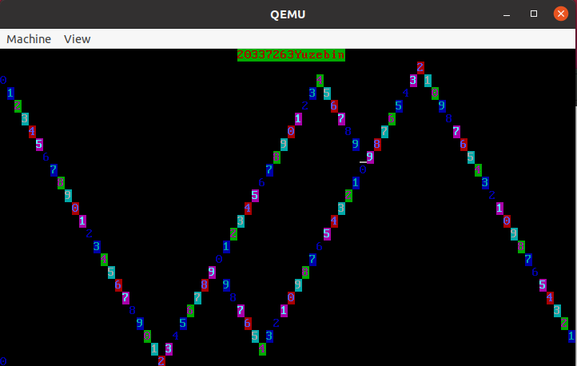

包括：主要工具安装使用过程及截图结果、程序过程中的操作步骤、测试数据、输入及输出说明、遇到的问题及解决情况、关键功能或操作的截图结果。不得抄袭，否则按作弊处理。

## 实验总结

​	这次实验主要还是在bios显示以及int 10h，16h中断的调用方面的下了很大的一部分功夫，主要就是要熟悉X86汇编以及其中的各式各样的寄存器，尤其是要记住各个寄存器的位数大小，比如eax32位ax16位ah和al8位之类的了，然后就是对照这些中断包括后面的调试格式来使用这些寄存器了，int10h也比较类似于一个run一样的技能，就是在各个需要的参数都摆入到寄存器后的开始运行的操作，所以整个实验的操作就是通过好多个这样的小中断所实现的，然后因为这些中断都是要把一些固定的和可变的参数所放入固定的寄存器内，所以这些操作除了变化的那些寄存器，其余的是可以写入函数里然后call function的，我 在写4的时候在觉得上面的学号以及姓名都非常的长，如果按照2.2的方法一个一个移动光标写入字符很费劲，就算是将移动光标和写入字符一次都封成一个函数，那也要call15次这个函数，所需要的代码量可能比我整个项目的一半都要多了，所以这个时候就要去发现新的更加简便的方法，然后在网上找到了直接表示字符串的方法。然后这次实验增长最多的可能是对于x86汇编的理解吧，上学期的计算机组成原理中学的是mips类型的汇编，与这个汇编差距也不是特别大，主要还是在寄存器和格式上的一些区别，也让我大概了解了计算机的启动过程以及在后面要加上固定的编码的必要性吧

每人必需写一段，文字不少于500字，可以写心得体会、问题讨论与思考、新的设想、感言总结或提出建议等等。不得抄袭，否则按作弊处理。

## 参考文献

https://blog.csdn.net/fantasyYXQ/article/details/122864782

https://blog.csdn.net/niyaozuozuihao/article/details/91802994

https://blog.csdn.net/qingkongyeyue/article/details/68490194?ops_request_misc=%257B%2522request%255Fid%2522%253A%2522164713570316780271935786%2522%252C%2522scm%2522%253A%252220140713.130102334..%2522%257D&request_id=164713570316780271935786&biz_id=0&utm_medium=distribute.pc_search_result.none-task-blog-2~all~sobaiduend~default-1-68490194.article_score_rank&utm_term=int+16h&spm=1018.2226.3001.4187