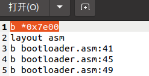

**操作系统原理 实验三**

## 个人信息

（此部分需补充完整）

【院系】计算机学院

【专业】计算机科学与技术

【学号】20337263

【姓名】俞泽斌

## 实验题目

从实模式到保护模式

## 实验目的

1. 从16位的实模式跳转到32位的保护模式，然后在平坦模式下运行32位程序。
2. 学习如何使用I/O端口和硬件交互，为后面保护模式编程打下基础。

## 实验要求

1. 从外存中加载程序到内存中运行，用LBA方式读写硬盘。
2. 从实模式进入到保护模式。
3. 在保护模式下运行自定义的汇编程序。
4. 撰写实验报告。

## 实验方案

​	Assignment 1

​	1.1就是在tutorial文件夹里的教程，通过LBA的方式来读取硬盘，主要代码在原来的文件中都已经给明，所以只需要编译命令

```
nasm -f bin bootloader.asm -o bootloader.bin
dd if=bootloader.bin of=hd.img bs=512 count=5 seek=1 conv=notrunc
nasm -f bin mbr.asm -o mbr.bin
dd if=mbr.bin of=hd.img bs=512 count=1 seek=0 conv=notrunc
qemu-system-i386 -hda hd.img -serial null stdio 
```

即可实现

​	1.2中需要将LBA28读取硬盘的方式换成CHS读取，同时给出逻辑扇区号向CHS的转换公式，首先查阅tutorial中给的相关资料发现int 13h的写磁盘功能如下


​	然后主要的操作就是改变源代码里面的asm_read_hard_disk:这个函数，原来的操作是用LBA方法读取，现在改成使用CHS的方法读取5个扇区，然后因为在LBA方法里面的asm_read_hard_disk:函数是一个扇区一个扇区地读入的，所以在load_bootloader中调用了5次上述函数，然后int 13h里面的读入扇区操作可以直接读入


其中通过tutorial里给的参考网站找到了chs的计算公式

绝对扇区=(逻辑扇区 mod 每个柱面的总扇区数) +1；=lba%63+1
绝对磁头=(逻辑扇区/每个柱面的总扇区数) mod 总磁头数=(lba/63)%18;
绝对柱面= 逻辑扇区/(每个柱面的总扇区数 * 总磁头数)=lba/(18*63)

​	Assignment 2

2中的是要求进入保护模式的4个重要步骤上设置断点，用gdb调试来看里面的各类寄存器的变化，首先这4个重要步骤是

1. **准备GDT，用lgdt指令加载GDTR信息**。
2. **打开第21根地址线**。
3. **开启cr0的保护模式标志位**。
4. **远跳转，进入保护模式**。

那么第一个gdt的因为一开始在gdb里面使用info registers命令的时候发现没有gdtr寄存器，后来发现可以使用qemu里的命令来查看这个寄存器，然后在这一行打上断点，基本的打断点的gdb命令如下图


然后结合一下代码


就表明打上的断点在四个重要步骤之间，至于后续的查看寄存器的值的方面就放到实验过程步骤中再做详细阐述

​	Assignment 3

​	3中的操作主要的操作就是改动lab2中的代码的区别了，主要的区别是在于中断不能用了，也就是lab2里的光标移动，光标位置写入，包括清屏，延时功能都无法使用，但是主要的代码架构都没有区别，所以主要的方面就三个了，一个是字符的变化及归零，第二个是颜色的变化及归一，第三个是字符的移动已经反弹，其中第三个可以说是可以直接照搬lab2的代码，因为在原来dh，dl的值的改动方面32位也没有什么区别，这里使用的是bh，bl，因为如果继续使用dhdl的话在print里面互相的赋值就有错误，主要是因为很难使用si，di的前8位，所以这两个寄存器就相当于被限制使用了，那我还是将他们作为两个标志位，也就是标志着主方向的位置，bl和bh用来代表坐标


后面的一大操作就是print的事情了，主要的操作是采用lab2中hello world最初的版本，也就是没有使用中断的版本，采用的是gs的输出方式，也就是gs:80*x+y(x,y)来代表坐标，然后就是要把这里的x和y求出来，就首先把ebx和edx都保存到栈里面，然后将dh，dl都放到两个大寄存器的低位，防止溢出操作，然后乘80相加再乘2，保存最后的数代表了两个坐标


现在我们来解决第一个问题，字符的递增和归零，其实我们可以看到mov word[gs:ebx],ax的指令，也就是数据是保存在ax寄存器中输出的，那我们就将0~9的数字保存在寄存器中，有两个办法，其一就是将0123456789存在一个地址里，然后把这个地址赋给esi，发现然后将[esi]输入到ax中，读到的就是单个的数字，然后不断加一就可以递增，清零操作就判断有没有超出10+原地址就行了，第二个办法就是像下面的代码一样，直接用ascii码来存储，后来发现也可以直接读取‘ ’里的数据转化成ASCII码，就直接用‘ ’里的数据了，也方便读代码


颜色的递增归零也和上面一样了，就是寄存器有些区别


清屏操作，就是循环着输出空格，然后让循环布满整个屏幕


延迟操作，就是进行一次大数字的循环，只有数到那个值了才进入下一次打印操作


然后其余的就和lab2中的4.asm几乎一模一样了，因为里面也没有涉及到中断，也就把对应的寄存器改了改就没有了


其实还有主要的就是这些东西都要放置在进入安全模式的四个重要步骤之后，才算是进入保护模式的操作，其实原来也想过在保护模式进入之前用中断来清屏，后来发现了输出空格来清屏的方法，就不这么操作了。

包括：硬件或虚拟机配置方法、软件工具与作用、方案的思想、相关原理、程序流程、算法和数据结构、程序关键模块，结合代码与程序中的位置位置进行解释。不得抄袭，否则按作弊处理。

## 实验过程

1.1


出现run BootLoader的字样，说明读取了第二个扇区开始的五个扇区中的内容，lba读取方式成功，

1.2


也出现了run BootLoader，与example1中相同，表明实验成功

2

2主要是在4个重要步骤前后设置断点，然后比较其中各个寄存器的值，主要的断点如图




1. **准备GDT，用lgdt指令加载GDTR信息**。

   因为gdt寄存器在gdb模式下没有这个寄存器，所以采用qemu的方法进行调试

   

   可以看到里面的gdt寄存器的值为27，表明gdt发生了改变，接下来开始分布操作

2. **打开第21根地址线**。

   首先我们看一下一开始没有打开的al寄存器的值，这时候的断点在0x7e00

   

   然后经过这一段代码后的值，发生变动，说明第21根地址线打开成功

   

3. **开启cr0的保护模式标志位**。

   起始状态的eax和cr0寄存器

   

   经过了开启cr0的保护模式标志位后，cr0和eax发生所要求的变化，说明打开标志位成功

   

4. **远跳转，进入保护模式**。

   


3

​	3里面原来遇到的问题是两个寄存器发生冲突的问题，主要是原来使用的是dh和dl，然后赋值的过程中发现后面的数据又要用到，就改变这里数据的寄存器，然后原来是采用第一种方法输出字符的，就是将整个数组保存到地址里，然后用esi来保存首地址的操作，但和后面反弹时的si，di为主方向的又发生了冲突，就采用直接对al赋值的方式来输出字符了

​	一开始也又犯了lab2里犯过的时，就是在判断完是最大点后忘记直接-1，不然后续就会有两个最大点在一个 反弹的过程中


这是刚开始的，print之前的所有寄存器


查看color_reset的初始值是否完全


标题输出成功，颜色改变，字符改变都成功，反弹也做好了，表明实验成功

包括：主要工具安装使用过程及截图结果、程序过程中的操作步骤、测试数据、输入及输出说明、遇到的问题及解决情况、关键功能或操作的截图结果。不得抄袭，否则按作弊处理。

## 实验总结

​	本次实验代码量其实不是很大，最大的代码量的任务大多数都可以复制lab2里的代码，只需要做一些改动即可，通过本次实验，首先我对LBA读取磁盘里的数据有了初步的认识，然后对于磁盘中柱面，磁头，扇区的三级结构也有了了解，后续通过CHS的操作了解了int 13h的相关属性以及出入接口，也找到了CHS和LBA格式的相互转换。

​	第二个实验主要的操作是通过gdb调试来实现了，也让我对gdb有了认识，自己主要的收获是在学会使用了layout asm的操作来分屏查看里面的代码和我通过控制台进行的操作，可以可视化地看到代码的调试过程，然后加上info register的功能，加上断点的使用来慢慢一步步地查看每个需要使用的寄存器的值，同时进入保护模式的操作也比较复杂，这次实验也用到了qemu的monitor模式下来调试，用来查看gdt寄存器（在gdb的info register里没有）

​	第三个实验更多的是对于一些寄存器的使用和改动，主要的问题在于无法使用中断后的输出问题，我们采用的方式是mov word[gs:ebx],ax的指令，同时在原来给的example1里的代码里有关于字符数组输出的有关代码，找到后进行修改也实现了在上面实现显示学号功能的操作，其余的主要问题还是有关寄存器位数的问题，一开始用的si，想要将它输出到ax低位al里面，一直报错，后来才发现位数不匹配，同时要开始对几个寄存器进行规划，不然最后都没有合适位数的寄存器来使用。

这次实验中使用的makefile和gdbinit的思路也方便了调试的需要，减少了自己一条一条输入命令的操作，也提高了实验调试的效率。

每人必需写一段，文字不少于500字，可以写心得体会、问题讨论与思考、新的设想、感言总结或提出建议等等。不得抄袭，否则按作弊处理。

## 参考文献

    LBA向CHS模式的转换。[https://blog.csdn.net/G_Spider/article/details/6906184]
    int 13h中断。[https://blog.csdn.net/brainkick/article/details/7583727]

https://blog.csdn.net/jadeshu/article/details/89072512?ops_request_misc=%257B%2522request%255Fid%2522%253A%2522164835508816782246477543%2522%252C%2522scm%2522%253A%252220140713.130102334..%2522%257D&request_id=164835508816782246477543&biz_id=0&utm_medium=distribute.pc_search_result.none-task-blog-2~all~sobaiduend~default-1-89072512.142^v5^pc_search_result_control_group,143^v6^control&utm_term=lba&spm=1018.2226.3001.4187

保护模式下字符显示https://blog.csdn.net/Zllvincent/article/details/83550490?ops_request_misc=&request_id=&biz_id=102&utm_term=bios%E4%BF%9D%E6%8A%A4%E6%A8%A1%E5%BC%8F%E5%B1%8F%E5%B9%95%E6%98%BE%E7%A4%BA%E5%AD%97%E7%AC%A6&utm_medium=distribute.pc_search_result.none-task-blog-2~all~sobaiduweb~default-0-83550490.142^v5^pc_search_result_control_group,143^v6^control&spm=1018.2226.3001.4187