**操作系统原理 实验四**

## 个人信息

【院系】计算机学院

【专业】计算机科学与技术

【学号】20337263

【姓名】俞泽斌

## 实验题目

保护模式下中断的实现

## 实验目的

1. 能使用C/C++编写内核，实现自定义内核内容。
2. 成功触发自定义的中断处理函数
3. 非纯汇编下实现自定义时钟中断处理

## 实验要求

1. 学习混合编程基本思路
2. 使用C/C++编写内核
3. 学习对中断的处理
4. 实现时钟中断
5. 撰写实验报告

## 实验方案

​	Assignment 1 混合编程的基本思路

​	这个实验主要的问题就在于对混合编程的理解方面了，首先是在汇编语言中调用c/c++的函数，调用c 的函数主要就是在前面的汇编代码中加上extern func_c就可以了，因为c的编译中不会涉及到名字修饰的操作，也就是说编译前什么名字编译后还是什么名字，所以在最后c，汇编都编译好，需要链接的时候可以找到彼此，然后c++的函数就比较复杂，因为c++允许函数的重载，所以在c++的源码中需要加上 extern “C” void func_C++();这样可以让c++文件在编译这个函数的时候按照c的规则进行编译，不进行名字修饰，就可以找到链接了，然后在汇编中也加入像调用c代码一样的声明语句extern func_c++就可以了，然后make的主要代码也都进行了给出，而且make只是把这些编译命令合在了一个文件中，主要操作就是编译。将预处理文件转换成汇编代码文件汇编。将汇编代码文件文件转换成可重定位文件。链接。将多个可重定位文件链接生成可执行文件。

​	Assignment 2 使用C/C++来编写内核

​	这个实验来说就是关于整个文件的管理方面的事情了，就是将所有的.c,.cpp的文件都放到src文件夹中，然后将编译所产生的bin，o文件都放到build的文件夹中，同时build里面还有makefile的文件包含了所有的编译和运行的命令来方便对整个文件夹中的操作，然后所有的代码所需要的声明文件都单独地建立一个文件来使用，包括调用不同性质的代码中所需要的extern等代码操作，就可以直接编译了，这个程序总体也就是一个互相调用的过程，就是一开始首先运行的是mbr，之后跳转到BootLoader，然后又跳到kernel，kernel里又调用了utils的文件，就是将基本所有的不同代码调用都实现了一遍。但主要makefile已经给出，所以编译和运行都是直接make 和make run就可以了。

​	Assignment 3 中断的处理

​	这个实验主要的操作其实就是一个函数的改动，也就是更改Example中默认的中断处理函数为自己编写的函数，example中默认的中断处理函数为asm_interrupt_empty_handler这个函数，如果不改这个函数名字的话就比较简单了，就是改动这个函数一个就可以了，然后我这里采用的是在原有的输出下面加上my interrupt handle ways start的字符串，同时改动了这个函数的名字来熟悉哪里需要函数的调用，如果要改动这个函数的名字的话，就需要将setInterruptDescriptor(i, (uint32)asm_unhandled_interrupt, 0)这个函数里面的函数名也进行改动，就是256个中断描述符都采用这一个，并且将asm_utils.h和asm.utils.asm以及interrupt.cpp中的声明进行改动，来让我的新函数my_asm_interrupt函数为global函数，能够被interrupt.cpp里调用

​	 Assignment 4 时钟中断

​	计算机需要知道这些中断请求的中断向量号和以何种优先级来处理同时到来的中断请求。通过8259A芯片来解决的，8259A芯片又被称为可编程中断控制器，在使用8259A芯片之前我们需要对8259A的两块芯片进行初始化。初始化过程是依次通过向8259A的特定端口发送4个ICW，ICW1~ICW4，ICW1，ICW3，ICW4的值已经固定，可变的只有ICW2。对于8259A芯片产生的中断，我们需要手动在中断返回前向8259A发送EOI消息。如果没有发送EOI消息，那么此后的中断便不会被响应。对于中断程序的编写采用以下三个步骤1、保护现场。2、中断处理。3、恢复现场。所以这里的实验主要还是对于代码的改动方面的东西，主要改动的代码还是在c_time_interrupt_handler()里的操作，给的参数主要是times，然后实现跑马灯显示的效果，主要就是调用它给的几个函数，也就是封装好的汇编函数，关于光标移动和在光标处写东西的操作，然后不断地写入字符，写入空格，就可以实现所需要的效果了，还有一个就是延迟操作，其实也就是在输出一个字符后加入一段空的循环操作，来让时间延长。

包括：硬件或虚拟机配置方法、软件工具与作用、方案的思想、相关原理、程序流程、算法和数据结构、程序关键模块，结合代码与程序中的位置位置进行解释。不得抄袭，否则按作弊处理。

## 实验过程

Assignment 1 混合编程的基本思路

汇编函数里的调用就是直接call相应的函数就可以了，然后如果函数为c代码的函数的时候，需要在汇编代码中声明这个函数来自于外部

```
extern function_from_C
```

声明之后就可以直接 call function_from_C

如果想要使用的函数为c++代码时，因为c++允许函数的重载，所以首先需要在c++的源代码里面加上

```
extern "C" void functionFromCpp();
```

用来告诉编译器按C代码的规则编译，不进行名字修饰，然后在汇编代码中加入声明语句

```
extern function_from_CPP
```

关于在c/c++中调用汇编代码的函数，就是在汇编代码中将函数声明global

```
global function_from_asm
```

然后我们在C/C++中将其声明来自外部即可

```
extern void function_from_asm();c
extern "C" void function_from_asm();c++
```

如果调用的函数含有参数的话，那么参数从右向左依次入栈。如果函数有返回值，返回值放在eax中。放置于栈的参数一般使用ebp来获取，然后记得调用完函数将栈里的参数取出来并且回复栈指针。

global关键字的作用就是在在c/c++中调用汇编代码的函数用在汇编代码里进行声明，防止后面链接步骤找不到这个函数

extern关键字的作用在于在汇编代码中声明这个函数来自于外部，需要之后进行匹配

为什么C++的函数前需要加上`extern "C"`？因为c++允许函数的重载，这样能够用来告诉编译器按C代码的规则编译，不进行名字修饰

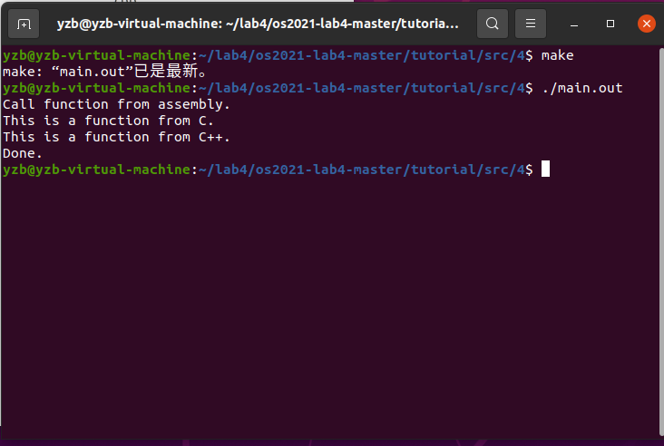

​	Assignment 2 使用C/C++来编写内核

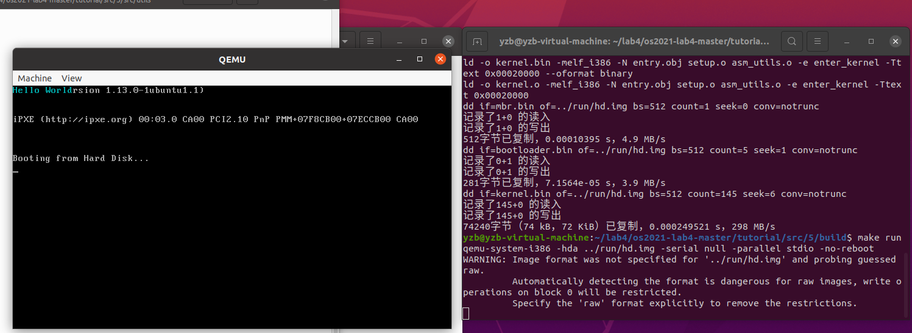

首先是关于hello world的复现操作了，其实这个makefile已经给出，所以编译和运行都是直接make 和make run就可以了，主要的操作就是在编译和运行文件

assignment2主要的运行原理就是在bootloader进入保护模式，然后加载操作系统内核到0x20000中，首先看BootLoader.asm，上面就是进入保护模式的代码，lab3中已做详细说明，就直接看这个函数，就是读取硬盘后跳转到kernel

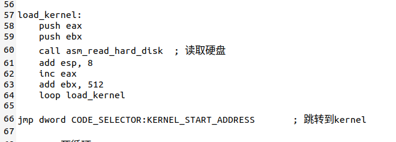

跳转到kernel以后就是关于kernel的操作和定义了，kernel首先定义200个扇区，起始地址为0x20000，第六个扇区，跳转过去后用定义了一下enter_kernel，然后跳转到setup_kernel函数里，概括来说就是bootloader在执行跳转到`0x20000`后，执行的第一条指令是`jmp setup_kernel`。在`jmp`指令执行后，我们便跳转到使用C++的函数setup_kernel。

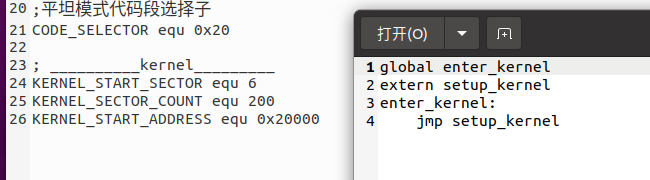


```
#include "asm_utils.h"

extern "C" void setup_kernel()
{
    asm_hello_world();
    while(1) {

    }

}
```

c++的函数中就调用了asm_hello world，所以我们只需改动asm_hello_world里的代码就好了

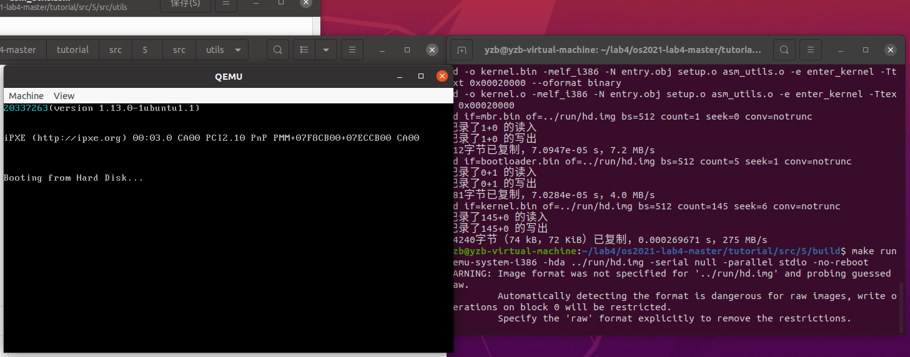

对于输出学号，其实就是改动asm_utils.asm里的代码，改动操作其实和lab2中的1没有区别，因为调用的都是汇编语言的函数输出。

​	Assignment 3 中断的处理

​	需要修改进入内核的部分代码，内核中的IDT表能够成功初始化，初始化分为以下三步

- 确定IDT的地址。

- 定义中断默认处理函数。

- 初始化256个中断描述符。

  需要注意的是，由于这里没有 ` main ` 函数，因而全局对象需要一个显式的构造函数来实现初始化，在本次实验中所用的代码是

  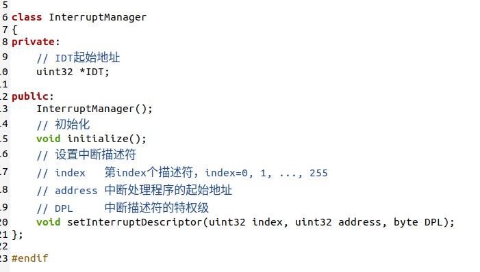

  为了能在 C  语言中调用修改系统 IDT 需要用到汇编指令  lidt ，需要对lidt这个指令进行汇编的封装，方便调用

  

  中断管理器`InterruptManager`，其定义放置在`include/interrupt.h`中，`initialize()`的函数来初始化IDT

  ```
  void InterruptManager::initialize()
  {
      // 初始化IDT
      IDT = (uint32 *)IDT_START_ADDRESS;
      asm_lidt(IDT_START_ADDRESS, 256 * 8 - 1);
  
      for (uint i = 0; i < 256; ++i)
      {
          setInterruptDescriptor(i, (uint32)asm_interrupt_empty_handler, 0);
      }
  }
  ```

将IDT设定在地址`0x8880`处，即`IDT_START_ADDRESS=0x8880`

调用`asm_lidt(IDT_START_ADDRESS, 256 * 8 - 1)`将地址存入寄存器IDTR，将IDT的信息放入到IDTR后，我们就可以插入256个默认的中断处理描述符到IDT中

在`InterruptManager::initialize`最后，我们调用`setInterruptDescriptor`放入256个默认的中断描述符即可，这256个默认的中断描述符对应的中断处理函数是`asm_unhandled_interrupt`。

```
for (uint i = 0; i < 256; ++i)
{
	setInterruptDescriptor(i, (uint32)asm_unhandled_interrupt, 0);
}
```

之后就是asm_unhandled_interrupt，该函数仅当触发中断时，显示字符串信息`'Unhandled interrupt happened, halt...'`

那么关于我自己的函数中断的处理就直接改动这个函数就可以了，在下面会有具体展示

如果不触发除零错误的话，我们采用x/256gx 0x8880的命令查看0x8880里面的值，这里我首先在make debug里c后发现没有设置断点才导致得到的数据都是零，然后我用Ctrl+C的方式在最后设置了断点然后进行查看

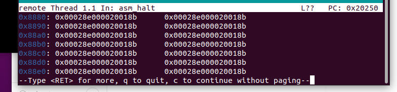

可以看到里面的的值符合tutorial里的值，也就是lidt加载成功

然后我们尝试触发除零错误，看下面的示例

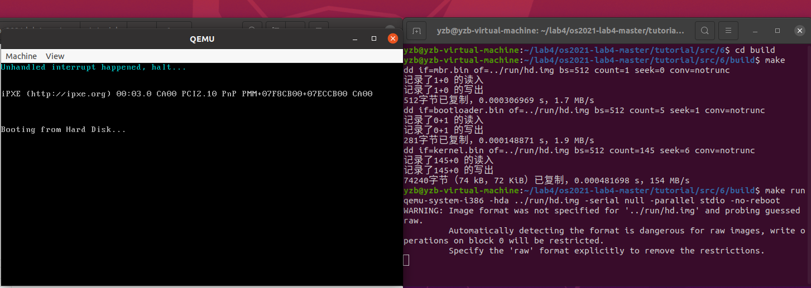

可以看到输出了Unhandled interrupt happened, halt...的字符串，表明中断发生并且处理了，也就是输出了字符，example3的复现已经实现

​	然后要求是实现自己的中断函数，我所做的修改主要是改变了函数名字为my_asm_interrupt，并且在后面的字符串中输出了my interrupt handle ways start的字符串来表明区别，后面主要的是一些声明的改变和一些函数调用的名字改变

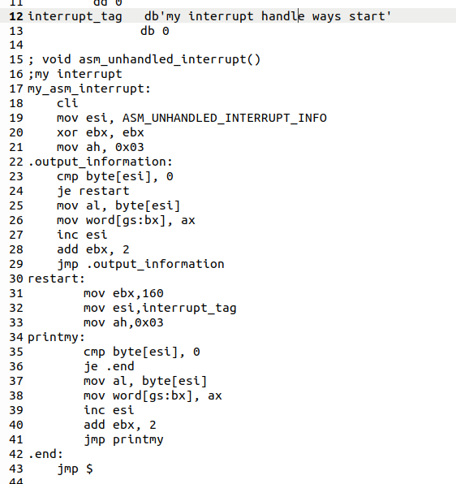

这是my_asm_interrupt函数的截图，也就是我的中断处理函数，主要也就是采用了输出字符串的形式来表明已经对中断进行了处理，主要的操作其实是改名，让我对后面c++调用汇编所需的几个声明进行了改动

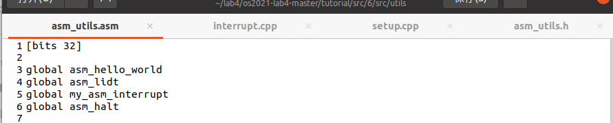

首先要改的声明是asm_utils.asm里的global，让我的中断处理函数在后面链接的步骤中也能被发现并被cpp函数调用


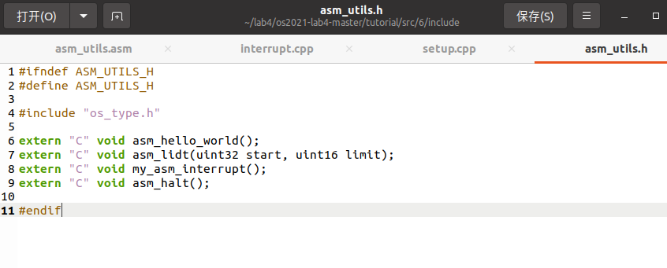

​	这是剩下的两个需要改动的方面，主要也是在运行的时候的报错所找到的，就是在c++函数前要加上使用这个汇编函数的声明 extern“C”，然后在setinterruptDescriptor的函数里面的参数进行改动，就可以实现后面的函数了

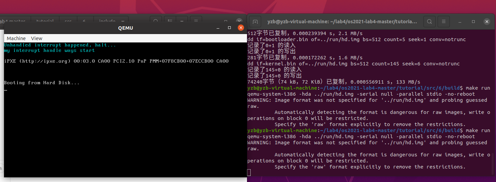

这样就实现了自己的中断处理函数了

​	Assignment 4 时钟中断

首先是example4的复现，主要原理如下，首先向中断控制器`InterruptManager`加入成员变量和函数，对其初始化，初始化的代码放置在成员函数`initialize8259A`中

```
void InterruptManager::initialize8259A()
{
    // ICW 1
    asm_out_port(0x20, 0x11);
    asm_out_port(0xa0, 0x11);
    // ICW 2
    IRQ0_8259A_MASTER = 0x20;
    IRQ0_8259A_SLAVE = 0x28;
    asm_out_port(0x21, IRQ0_8259A_MASTER);
    asm_out_port(0xa1, IRQ0_8259A_SLAVE);
    // ICW 3
    asm_out_port(0x21, 4);
    asm_out_port(0xa1, 2);
    // ICW 4
    asm_out_port(0x21, 1);
    asm_out_port(0xa1, 1);

    // OCW 1 屏蔽主片所有中断，但主片的IRQ2需要开启
    asm_out_port(0x21, 0xfb);
    // OCW 1 屏蔽从片所有中断
    asm_out_port(0xa1, 0xff);
}
```

为了方便对屏幕进行输出，我们简单封装一个能够处理屏幕输出的类`STDIO`，其中重要的部分是对于光标的处理部分与光标读写相关的端口为`0x3d4`和`0x3d5`，在对光标读写之前，我们需要向端口`0x3d4`写入数据，表明我们操作的是光标的低8位还是高8位。写入`0x0e`，表示操作的是高8位，写入`0x0f`表示操作的是低8位。如果我们需要需要读取光标，那么我们从`0x3d5`从读取数据；如果我们需要更改光标的位置，那么我们将光标的位置写入`0x3d5`，封装成`STDIO::moveCursor(uint position)`函数，移动光标

asm_in_port，和asm_out_port都是通过汇编函数来对in和out两个指令进行封装

定义中断处理函数`c_time_interrupt_handler`。这也是我们这个实验中需要改动的函数，由于需要显示中断发生的次数，我们需要在`src/kernel/interrupt.cpp`中定义一个全局变量来充当计数变量。然后加上汇编的调用如下

```
asm_time_interrupt_handler:
    pushad
    
    nop ; 否则断点打不上去
    ; 发送EOI消息，否则下一次中断不发生
    mov al, 0x20
    out 0x20, al
    out 0xa0, al
    
    call c_time_interrupt_handler

    popad
    iret
```

编写好了中断处理函数后，我们就可以设置时钟中断的中断描述符，也就是主片IRQ0中断对应的描述符，然后我们封装一下开启和关闭时钟中断的函数。关于8259A上的中断开启情况，我们可以通过读取OCW1来得知；如果要修改8259A上的中断开启情况，我们就需要先读取再写入对应的OCW1。开中断需要使用`sti`指令，如果不开中断，那么CPU不会响应可屏蔽中断。也就是说，即使8259A芯片发生了时钟中断，CPU也不会处理。开中断指令被封装在函数`asm_enable_interrupt`中

```
; void asm_enable_interrupt()
asm_enable_interrupt:
    sti
    ret
```

这样我们就完成了基本的example4的操作，似乎忘了截图，不过在我后来跑马灯的程序中上述的程序还是保留着的，所以可以看后面运行截图的上半部分就是example4的复现

那剩下的就是关于跑马灯的实现了，改动的主要就是`c_time_interrupt_handler`这个函数

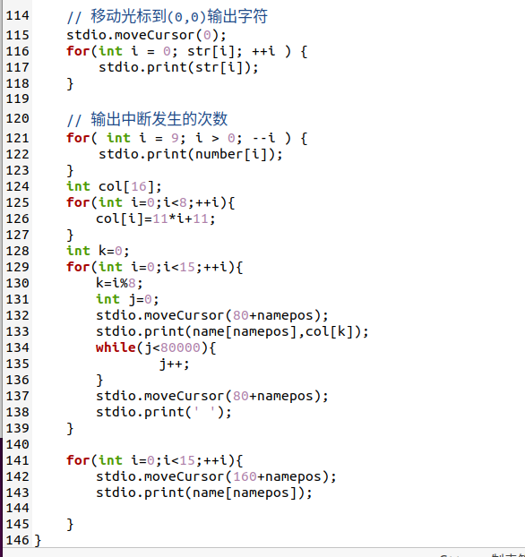

这里就是所有的函数改动后的截图，主要操作是通过对于几个已经封装好的函数的应用了，首先将光标位置选好，然后选择输出空格还是字符，这里用了两行，第二行是慢慢输出直到全部输出完成，第一行是一个一个字符地输出，输出后一个字符后马上将前一个字符除去，实现这样的效果。

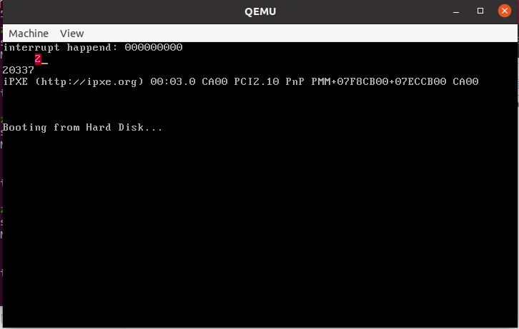

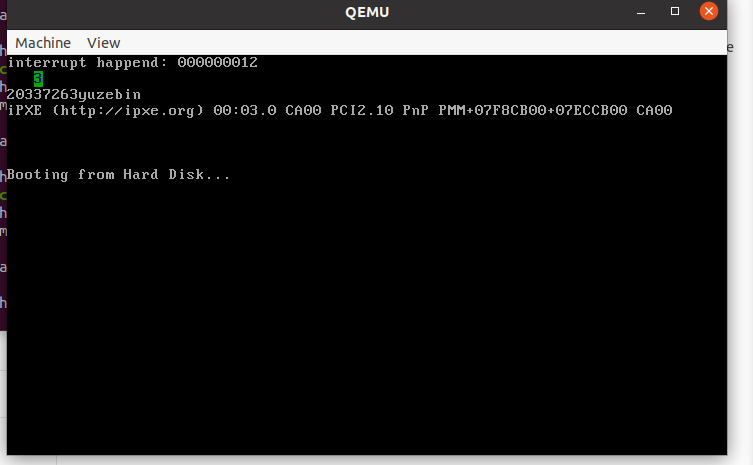

跑马灯效果实现，实验结束。


## 实验总结

​	通过本次实验，我了解了混合编程基本思路、makefile的作用与基本编写方法、使用C/C++编写内核、IDT的初始化、保护模式下中断的实现方法以及对于8295A有了基本的认识，了解了通过8295A进行编程的基本方法，首先我了解了程序编译的四个阶段：预处理（处理宏定义）、编译（将代码转化为汇编代码）、汇编（将汇编代码转化为二进制文件）、链接（将需要的二进制文件打包链接在一起）。令我印象较深刻的是cpp里面需要加extern “C” 来避免函数重载无法正确识别的问题，然后makefile将编译命令合在一起的一个整合，这样每次可以通过make&make run运行。内核部份我们使用C/C++来完成绝大部分的内容，汇编代码只是为我们提供汇编指令的封装

​	然后在保护模式下实现中断，首先是要进行中断描述符表(IDT)的初始化，设置IDTR，在这里使用gdb调试的过程中也让我发现了断点设置的重要性，就是一开始没有设置断点导致通过tutorial里的命令输出的地址上的数据都是零，后来才发现要在最后设置断点，也可以直接Ctrl c来在最后加上断点，输出才变得正常，然后是针对不同的中断编写中断处理程序。在8259A芯片，也就是可编程中断控制器的编程过程中，首先我了解了该芯片大概的接口以及工作原理，然后在两个实验中进行了关于in和out的封装，包括为了让在屏幕上显示更加方便来实现的stdio类以及里面的print函数，中间也涉及到了一些关于光标移动等需要使用汇编函数的操作，也重新再一次复习了关于混合编程的应用


## 参考文献

混合编程

https://blog.csdn.net/m0_37362454/article/details/86310664?ops_request_misc=%257B%2522request%255Fid%2522%253A%2522164924713516782246433716%2522%252C%2522scm%2522%253A%252220140713.130102334..%2522%257D&request_id=164924713516782246433716&biz_id=0&utm_medium=distribute.pc_search_result.none-task-blog-2~all~sobaiduend~default-1-86310664.142^v5^pc_search_result_control_group,157^v4^control&utm_term=%E6%B7%B7%E5%90%88%E7%BC%96%E7%A8%8B&spm=1018.2226.3001.4187

idt

https://blog.csdn.net/altercrazy/article/details/8128048?ops_request_misc=%257B%2522request%255Fid%2522%253A%2522164924709716780255242046%2522%252C%2522scm%2522%253A%252220140713.130102334..%2522%257D&request_id=164924709716780255242046&biz_id=0&utm_medium=distribute.pc_search_result.none-task-blog-2~all~sobaiduend~default-1-8128048.142^v5^pc_search_result_control_group,157^v4^control&utm_term=idt&spm=1018.2226.3001.4187

gdt与idt

https://blog.csdn.net/ice__snow/article/details/50654629?ops_request_misc=%257B%2522request%255Fid%2522%253A%2522164924709716780255242046%2522%252C%2522scm%2522%253A%252220140713.130102334..%2522%257D&request_id=164924709716780255242046&biz_id=0&utm_medium=distribute.pc_search_result.none-task-blog-2~all~sobaiduend~default-2-50654629.142^v5^pc_search_result_control_group,157^v4^control&utm_term=idt&spm=1018.2226.3001.4187

