<font size =6>**操作系统原理 实验五**</font>

## 个人信息

【院系】计算机学院

【专业】计算机科学与技术

【学号】20337263

【姓名】俞泽斌

## 实验题目

内核线程

## 实验目的

1. 学习C语言的可变参数机制的实现方法，实现可变参数机制，以及实现一个较为简单的printf函数。
2. 实现内核线程的实现。
3. 重点理解`asm_switch_thread`是如何实现线程切换的，体会操作系统实现并发执行的原理。
4. 实现基于时钟中断的时间片轮转(RR)调度算法，并实现一个线程调度算法。

## 实验要求

1. 实现了可变参数机制及printf函数。
2. 自行实现PCB，实现线程。
3. 了解线程调度，并实现一个调度算法。
4. 撰写实验报告。

## 实验方案

Assignment 1 printf的实现

首先是关于可变参数函数的实现了，因为printf中会涉及到%d%c之类的可变参数，所以在调用的过程中需要用到可变参数函数，教程中的例子是一个具有可变参数的函数print_any_number_of_integers，来向我们展示可变参数函数的主要步骤，也就是对整个可变参数的列表的操作，具体 需要遵循的规则如下，我们在后面也会用到

- 可变参数必须从头到尾逐个访问。如果你在访问了几个可变参数之后想半途中止，这是可以的，但是，如果你想一开始就访问参数列表中间的参数，那是不行的(可以把想访问的中间参数之前的参数读取但是不使用，曲线救国)。

- 这些宏是无法直接判断实际实际存在参数的数量。

- 这些宏无法判断每个参数的类型，所以在使用`va_arg`的时候一定要指定正确的类型。

- 如果在`va_arg`中指定了错误的类型，那么将会影响到后面的参数的读取。

- 第一个参数也未必要是可变参数个数，例如`printf`的第一个参数就是字符串指针。

  这一个函数输出的都是int类型的，那如果要输出不同类型的函数就只需要改变这个列表内的类型就可以了，也就是用printf第一个字符串中的%后的类型参数来指定类型，生成类型列表

然后我们具体看教程中的printf函数的实现，首先定义了一个缓冲区，然后对开始的字符进行fmt的解析，将解析后的字符放入缓冲区中，如果缓冲区满了就输出，第一个实现的是print函数，也就是实现具体的\n换行操作，然后封装了一个函数printf_add_to_buffer对`fmt`进行逐字符解析，对于每一个字符`fmt[i]`，如果`fmt[i]`不是`%`，则说明是普通字符，直接放到缓冲区即可，如果是的话，在printf函数中会对他进行一定操作后放入。

printf的实现还需要的是整数转变成字符串输出的函数，也就是itos的函数，然后参数列表中放入一个mod用来判断输出的是几进制的数字，在我们的新的prinf函数中也会使用到

我的printf的实现其实也就是在教程的基础上加上了double类型的字符的输出，并在小数点后出现0的地方截断，至于怎么对%d%c之类的字符串进行变换具体的来说就是每次向后移动可变参数指针，并根据前面的字符串中的%后的类型将参数按正确的类型输出，具体代码如下

```c++
int printf(const char *const fmt, ...)
{
    const int BUF_LEN = 32;

    char buffer[BUF_LEN + 1];
    char number[33];
    char number1[33];
    char number2[33];
    int idx, counter;
    va_list ap;

    va_start(ap, fmt);
    idx = 0;
    counter = 0;

    for (int i = 0; fmt[i]; ++i)
    {
        if (fmt[i] != '%')
        {
            counter += printf_add_to_buffer(buffer, fmt[i], idx, BUF_LEN);
        }
        else
        {
            i++;
            if (fmt[i] == '\0')
            {
                break;
            }

            switch (fmt[i])
            {
            case '%':
                counter += printf_add_to_buffer(buffer, fmt[i], idx, BUF_LEN);
                break;

            case 'c':
                counter += printf_add_to_buffer(buffer, va_arg(ap, char), idx, BUF_LEN);
                break;

            case 's':
                buffer[idx] = '\0';
                idx = 0;
                counter += stdio.print(buffer);
                counter += stdio.print(va_arg(ap, const char *));
                break;
	    
            case 'd':
            case 'x':
            {
                int temp = va_arg(ap, int);

                if (temp < 0 && fmt[i] == 'd')
                {
                    counter += printf_add_to_buffer(buffer, '-', idx, BUF_LEN);
                    temp = -temp;
                }

                itos(number, temp, (fmt[i] == 'd' ? 10 : 16));

                for (int j = 0; number[j]; ++j)
                {
                    counter += printf_add_to_buffer(buffer, number[j], idx, BUF_LEN);
                }
                break;
              }  
             case 'f':
             {
	        double temp2 = va_arg(ap, double);
                if (temp2 < 0 )
                {
                    counter += printf_add_to_buffer(buffer, '-', idx, BUF_LEN);
                    temp2 = -temp2;
                }
		int temphigh=temp2/1;
		int templow=(temp2-temphigh)*1000000;
                itos(number1, temphigh, 10);
		itos(number2,templow,10);
                for (int j = 0; number1[j]; ++j)
                {
                    counter += printf_add_to_buffer(buffer, number1[j], idx, BUF_LEN);
                }
                counter += printf_add_to_buffer(buffer, '.', idx, BUF_LEN);
                for (int j = 0; number2[j]; ++j)

                {
		     if (number2[j]=='0')
		     {
		     	break;
		     }
		     else
		     {
                    counter += printf_add_to_buffer(buffer, number2[j], idx, BUF_LEN);
		     }
                }

                break;
               }
            }
            
        }
    }

    buffer[idx] = '\0';
    counter += stdio.print(buffer);

    return counter;
}
```

代码主要还是调用了他输出int类型的思想，因为double类型的也无非就是两个int加上中间一个小数点，所以我通过templow，temphigh来表示小数部分和整数部分，分别采用int类型的输出方式也就是调用itos然后printf_add_to_buffer，对于小数部分增加了一个判断，就是判断有无0，防止后面输出一大串的零。


Assignment 2 线程的实现

这里主要的是关于pcb的设计方面了，教程中的pcb如下

```c
struct PCB
{
    int *stack;                      // 栈指针，用于调度时保存esp
    char name[MAX_PROGRAM_NAME + 1]; // 线程名
    enum ProgramStatus status;       // 线程的状态
    int priority;                    // 线程优先级
    int pid;                         // 线程pid
    int ticks;                       // 线程时间片总时间
    int ticksPassedBy;               // 线程已执行时间
    ListItem tagInGeneralList;       // 线程队列标识
    ListItem tagInAllList;           // 线程队列标识
};
```

其实已经十分完善了，但因为后面需要使用到线程调度的不同算法，所以我这里再在pcb中加入两个参数，一个是time_cost运行所需时间，另一个是bandwidth代表需要的带宽资源，如果后面线程调度的时候需要使用的话就可以读取并使用了。

```c
    int time_cost;		      // 运行时间
    int bandwidth;		      // 带宽需求
```

然后主要的工作就是关于ProgramManager::executeThread这个函数的改动了，其实也就是在参数列表中加上time_cost和bandwidth两个参数，然后将pcb这个struct里面的两个成员变量分别赋值就可以了

```c
	thread->status = ProgramStatus::READY;
    thread->priority = priority;
    thread->ticks = priority * 10;
    thread->ticksPassedBy = 0;
    thread->pid = ((int)thread - (int)PCB_SET) / PCB_SIZE;

    thread->time_cost=time_cost;
    thread->bandwidth=bandwidth;
```

然后改变一下输出格式和setup里面的executeThread函数，便于看到运行所产生的结果

```c
int pid = programManager.executeThread(first_thread, nullptr, "first thread", 1,11,2);
pid = programManager.executeThread(second_thread, nullptr, "second thread", 1,10,2);
pid = programManager.executeThread(third_thread, nullptr, "third thread", 1,9,2);
//每一个线程中的printf函数改动如下
printf("pid %d name \"%s\": Hello World! priority %d time_cost %d brandwidth %d\n", programManager.running->pid, programManager.running->name,programManager.running->priority,programManager.running->time_cost,programManager.running->bandwidth);
```

为了让这些在pcb中增加进去的成员变量有所作用，在实现完assignment4的调度算法后，我采用两个变量之和作为排序的参考依据，也就是调度的参考依据，在executeThread函数中所做的修改与assignment4大致相同，下面截取部分

```c
//readyPrograms.push_back(&(thread->tagInGeneralList));
    if(running!=nullptr&&thread->time_cost+thread->bandwidth < running->time_cost+running->bandwidth)//发生抢占
    {
        readyPrograms.push_front(&(thread->tagInAllList));
	ListItem *item = readyPrograms.front();
        PCB *next = ListItem2PCB(item, tagInGeneralList);
        PCB *cur = running;
        next->status = ProgramStatus::RUNNING;
        running = next;
        readyPrograms.pop_front();

        asm_switch_thread(cur, next);

        interruptManager.setInterruptStatus(status);
        return running->pid;
    }
    else//将readyprogram进行排序，将新创建的线程放入合适位置
    {
        if(readyPrograms.size()==0)
            readyPrograms.push_back(&(thread->tagInGeneralList));
        else
        {
            PCB *endpcb = ListItem2PCB(readyPrograms.back(), tagInGeneralList); 
            if(time_cost+bandwidth>=endpcb->time_cost+endpcb->bandwidth)
                readyPrograms.push_back(&(thread->tagInGeneralList));
            else
            {
                int p=0;
                ListItem* templist=readyPrograms.front();
                PCB *temppcb = ListItem2PCB(templist, tagInGeneralList); 
                
                while(time_cost+bandwidth>=temppcb->time_cost+temppcb->bandwidth)
                {
                    p++;
                    templist=templist->next;
                    temppcb = ListItem2PCB(templist, tagInGeneralList);
                }
                readyPrograms.insert(p,&(thread->tagInGeneralList));
            }
        }
    }
```

最后还是按照上面的setup进行输出，输出产生的线程调度是通过带宽和运行时间和来作为排序变量的。具体实现结果放在实验过程中。


Assignment 3 线程调度切换的秘密

大概理了理思路，首先是关于整个算法的大体思路，一开始是第一个进程开始使用，因为开始的时候调用的也就是

```c
asm_switch_thread(0, firstThread);
```

这个函数，所以首先转到的也就是asm_switch_thread（）的函数内，然后使得第一个线程开始运作之后，printf相应信息时，调度的函数一直在运作，因为第一个线程创建后有一段死循环，然后本实验使用的调度算法是在运行tick--一直到0之后就跳转到下一个线程继续执行，所以在第一个线程运行后就会一直调用时钟中断，也就是c_time_interrupt_handler函数来使得tick--，然后当tick为0的时候触发schedule函数调度readyProgram的下一个线程，即线程2

线程2正常运行，因为是正常运行，会跳转到program_exit，然后跳转到schedule进入线程3

线程3中也有一段死循环，那也就相当于线程1的做法，在一直调用时钟中断，c_time_interrupt_handler函数来使得tick--当tick为0的时候触发schedule函数，因为当时的readyProgram的第一项是线程1，所以跳转到线程1

然后一直死循环，使得一直在schedule和asm_switch_thread（）中间不断跳转，无法释放。

对于开始的两个问题

第一个：一个线程首先是通过asm_switch_thread函数来将刚创建的线程的栈指针放入esp中，保留原来的esp和四个寄存器的值，然后将那四个预留寄存器设置为0，分配新的pcb，使得esp指向这个线程所要运行的线程函数的地址，执行ret指令，使得从esp的地址开始执行，运行新的线程函数

第二个：在执行的线程的现场会被保存到栈里面，栈的位置也会保存到pcb里面，在下一次调度到这个pcb的时候，通过pcb中栈指向的地方跳转回schedule函数，恢复中断，也就是还原了现场，可以让线程继续执行

具体推理过程和实现截图放在实验过程中。


Assignment 4 调度算法的实现

教程里采用的是时间片轮转算法，主要的算法代码在schedule里面，主要思想在于对当前线程的`ticks`减1，直到`ticks`等于0，然后执行线程调度。调度的主要就是从readylist里面取出第一个然后进行改变

我这里采用的主要是抢占式的优先级调度算法，主要处理的其实是ProgramManager::executeThread函数，因为在创建线程的过程中，我可以将running和readylist都进行改动，就是如果当前创建的线程的优先级比当前运行的线程优先级更大的话，就将当前running的线程与现在创建的进程进行交换，并且将当前运行的线程放入readylist的首位，如果当前创建的线程的优先级比当前运行的线程优先级小的话，就在readylist里面给他找到一个优先级适合的位置，使得整个readylist按照优先级顺序从大到小进行排序，具体代码如下

```c
int ProgramManager::executeThread(ThreadFunction function, void *parameter, const char *name, int priority)
{
    // 关中断，防止创建线程的过程被打断
    bool status = interruptManager.getInterruptStatus();
    interruptManager.disableInterrupt();

    // 分配一页作为PCB
    PCB *thread = allocatePCB();

    if (!thread)
        return -1;

    // 初始化分配的页
    memset(thread, 0, PCB_SIZE);

    for (int i = 0; i < MAX_PROGRAM_NAME && name[i]; ++i)
    {
        thread->name[i] = name[i];
    }

    thread->status = ProgramStatus::READY;
    thread->priority = priority;
    thread->ticks = priority * 10;
    thread->ticksPassedBy = 0;
    thread->pid = ((int)thread - (int)PCB_SET) / PCB_SIZE;

    // 线程栈
    thread->stack = (int *)((int)thread + PCB_SIZE);
    thread->stack -= 7;
    thread->stack[0] = 0;
    thread->stack[1] = 0;
    thread->stack[2] = 0;
    thread->stack[3] = 0;
    thread->stack[4] = (int)function;
    thread->stack[5] = (int)program_exit;
    thread->stack[6] = (int)parameter;

    allPrograms.push_back(&(thread->tagInAllList));
    //readyPrograms.push_back(&(thread->tagInGeneralList));
    //这里用的主要是priority来进行优先级判断的抢占或排序，如果用的是assignment2里的话，也可以用time_cost和bandwidth进行排序，只需要改动相关变量就可以了
    if(running!=nullptr&&thread->priority > running->priority)//发生抢占
    {
        readyPrograms.push_front(&(thread->tagInAllList));
	ListItem *item = readyPrograms.front();
        PCB *next = ListItem2PCB(item, tagInGeneralList);
        PCB *cur = running;
        next->status = ProgramStatus::RUNNING;
        running = next;
        readyPrograms.pop_front();

        asm_switch_thread(cur, next);

        interruptManager.setInterruptStatus(status);
        return running->pid;
    }
    else//将readyprogram进行排序，将新创建的线程放入合适位置
    {
        if(readyPrograms.size()==0)
            readyPrograms.push_back(&(thread->tagInGeneralList));
        else
        {
            PCB *endpcb = ListItem2PCB(readyPrograms.back(), tagInGeneralList); 
            if(priority<=endpcb->priority)
                readyPrograms.push_back(&(thread->tagInGeneralList));
            else
            {
                int p=0;
                ListItem* templist=readyPrograms.front();
                PCB *temppcb = ListItem2PCB(templist, tagInGeneralList); 
                
                while(priority<=temppcb->priority)
                {
                    p++;
                    templist=templist->next;
                    temppcb = ListItem2PCB(templist, tagInGeneralList);
                }
                readyPrograms.insert(p,&(thread->tagInGeneralList));
            }
        }
    }

    // 恢复中断
    interruptManager.setInterruptStatus(status);

    return thread->pid;
}
```

然后同assignment2一样，对于setup的进程进行改动，改变其优先级来，对输出来判断是否按照优先级输出而不是顺序输出

```c
int pid = programManager.executeThread(first_thread, nullptr, "first thread", 2);
    pid = programManager.executeThread(second_thread, nullptr, "second thread", 1);
    pid = programManager.executeThread(third_thread, nullptr, "third thread", 3);
```

实验结果放在实验过程目录下


## 实验过程

Assignment 1 printf的实现

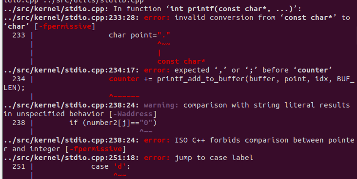

这里一开始遇到的问题如上图，发现是关于单引号和双引号的区别的方面，主要是双引号内的字符格式可能会改变成const char*，就与后面的操作不匹配了，需要修改为单引号

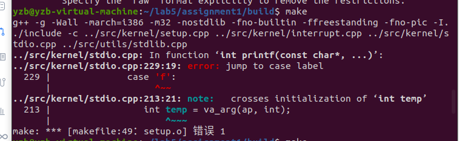

后来一直出现jump to case label的报错信息，查询资料得知是case语句的问题，主要问题是case f和后面的case d中间的语句没有加上大括号，所以里面可能有些变量发生了冲突，导致报错，修改后正常输出如下图

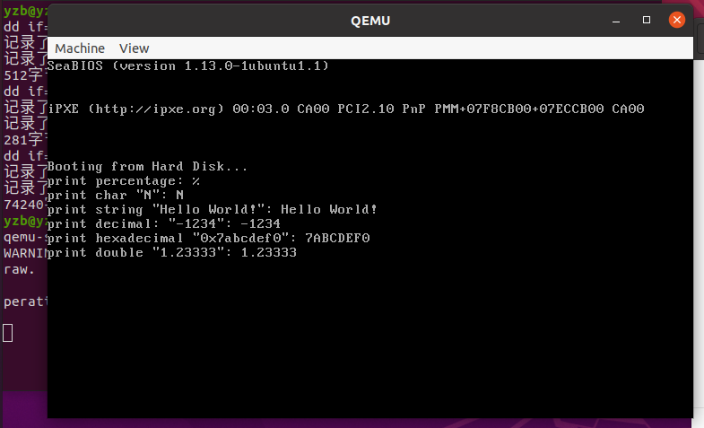

可以看到不仅前面正常的printf函数正常输出，并且自己加上的输出double类型得到print函数也正常输出


Assignment 2 线程的实现

这里主要加上的改动是关于两个参数，一个是time_cost运行所需时间，另一个是bandwidth代表需要的带宽资源，然后我在后面的setup函数中通过每一个线程的printf函数将当前运行的线程的所需参数，改变一下输出格式和setup里面的executeThread函数，便于看到运行所产生的结果

```c
int pid = programManager.executeThread(first_thread, nullptr, "first thread", 1,11,2);
pid = programManager.executeThread(second_thread, nullptr, "second thread", 1,10,2);
pid = programManager.executeThread(third_thread, nullptr, "third thread", 1,9,2);
//每一个线程中的printf函数改动如下
printf("pid %d name \"%s\": Hello World! priority %d time_cost %d brandwidth %d\n", programManager.running->pid, programManager.running->name,programManager.running->priority,programManager.running->time_cost,programManager.running->bandwidth);
```

运行结果如下图

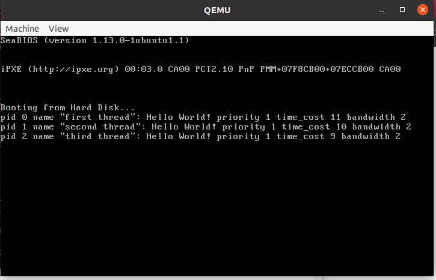

因为这个实验中没有实现新的线程调度的函数，所以输出的时候还是直接按照顺序输出，如果像assignment4中的线程调度函数进行改变，就可以采用time_cost和bandwidth两个参数作为排序的顺序，也就是输出的顺序了，但至少本次实验还是读取了所需要的参数并产生线程输出了

为了让这两个变量用起来，我也增加了所需要的线程调度函数，具体方案在实验方案中已经给出，下面是运行结果

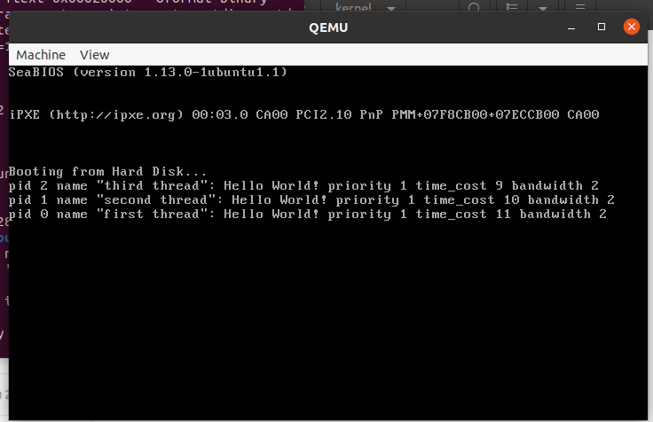

可以看到按照time_cost 和bandwidth的和进行线程调度。

Assignment 3 线程调度切换的秘密

- 一个新创建的线程是如何被调度然后开始执行的。

- 一个正在执行的线程是如何被中断然后被换下处理器的，以及换上处理机后又是如何从被中断点开始执行的。

  第一个问题

首先在实验方案中已经对本次实验中的线程调度进行了基本的说明，为了查看这些函数是否都按照上述进行调用，需要在gdb调试的时候将上述函数的开始处都打上断点，来查看函数的相互调用以及线程运行的具体过程

所以修改gdbinit如下

```c
target remote:1234
file ../build/kernel.o
set disassembly-flavor intel
add-symbol-file entry.obj

b schedule
b asm_switch_thread
b switch_end
b first_thread
b second_thread
b third_thread
b program_exit
b c_time_interrupt_handler

```

后来其实把最后一条 b c_time_interrupt_handler删去了，因为没做一次死循环都会调用10次c_time_interrupt_handler，调试起来过于繁琐。

现在开始调试

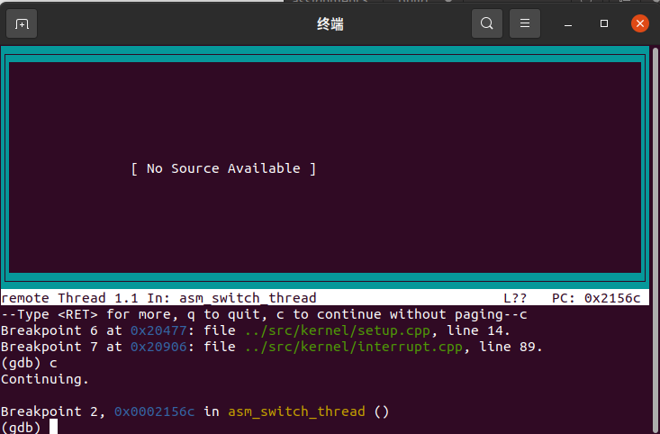

第一次运行，在asm_switch_thread中停下，是要使第一个线程开始调用的asm_switch_thread(0, firstThread);函数，然后我们看一下当前的各个寄存器的值

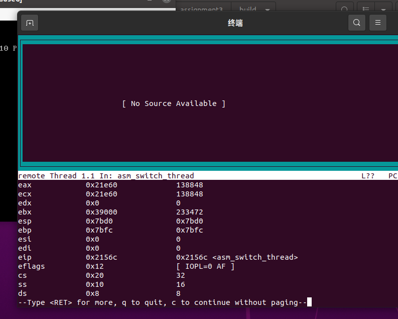

此时栈指针(esp)的值是0x7bd0，指向的是调用asm_switch_thread前的函数的下一条指令的地址，然后继续执行

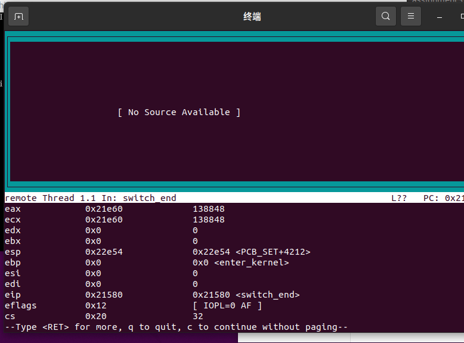

可以看到esp的值发生了改变，为0x22e54，与原来相差4096个字节，刚好是一页pcb的字节数，说明第一个线程已经开始分配pcb

并且此时esi，edi，ebx，ebp的值都因为pcb的构造函数而都赋值为0，然后继续执行

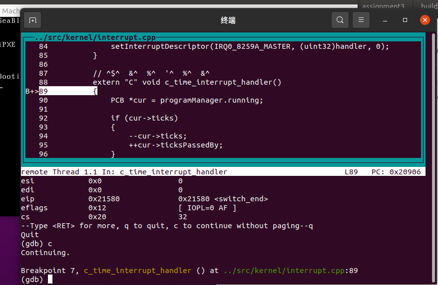

可以看到进入了c_time_interrupt_handler函数，因为线程1的while死循环触发了时钟中断，然后c_time_interrupt_handler函数会进行10次，具体不再放入

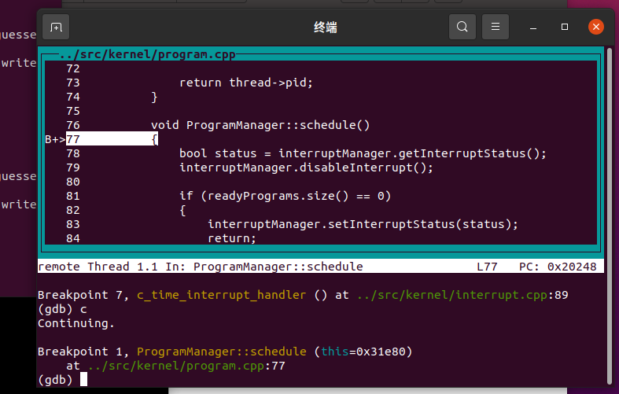

10次循环后进入schedule函数，发现线程1的状态还是running，所以将线程1的ticks加10，然后放入就绪队列中，从就绪队列中取出下一个线程，继续调用asm_switch_thread函数

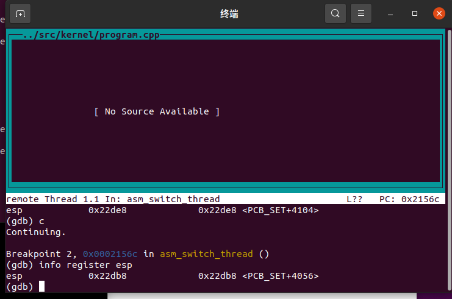

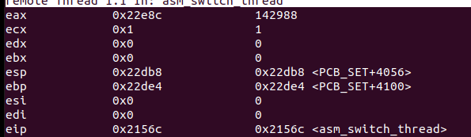

此时esp为0x22db8，四个寄存器也都有部分有值，下面会将esp的值和四个寄存器进行保存，使得下一次还能从这个地方开始运行。再继续运行

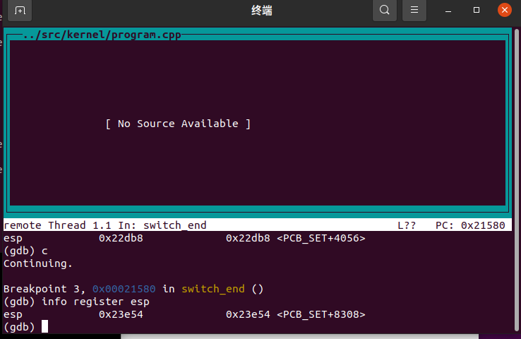

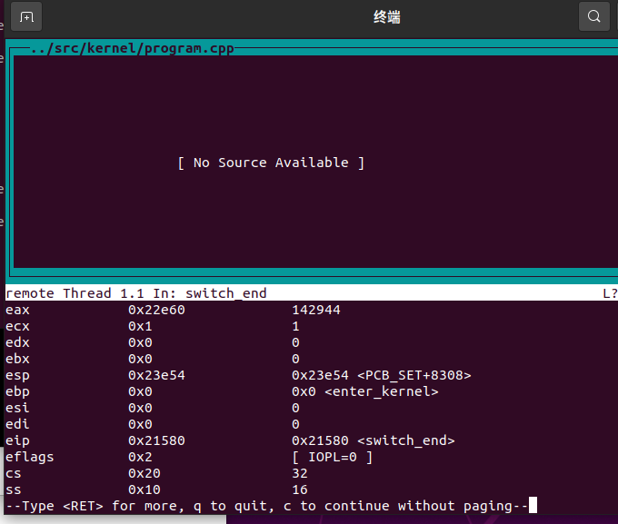

esp的值又加上了4096，为第二个线程分配的PCB，同时这四个寄存器都赋值为0，让下一个线程来使用，ret回到esp指向的地址，开始运行线程2

**至此，第一个问题结束，一个线程首先是通过asm_switch_thread函数来将刚创建的线程的栈指针放入esp中，保留原来的esp和四个寄存器的值，然后将那四个预留寄存器设置为0，分配新的pcb，使得esp指向这个线程所要运行的线程函数的地址，执行ret指令，使得从esp的地址开始执行，运行新的线程函数**

**第二个问题：**

**一个正在执行的线程是如何被中断然后被换下处理器**

**这一部分已经在上面演示过了，主要的操作就是中断次数达到了预设的值的时候，也就是ticks==0的时候，会调研schedule函数，然后发现这个线程还是在运行状态下的，所以将ticks加10 后放入就绪队列中，然后保存其中的esp和四个寄存器的值，改变esp，将四个寄存器赋值为0，调用ret执行下一个线程函数**

然后我们继续

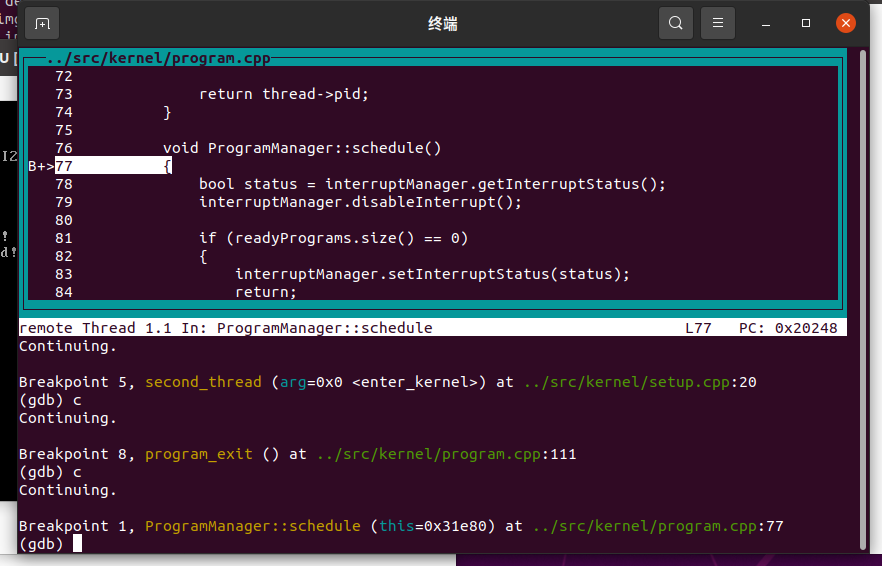

第二个线程是没有死循环的，所以可以很自然地过度到program_exit函数并进入schedule函数，直接改变esp和四个寄存器，开始运行线程3

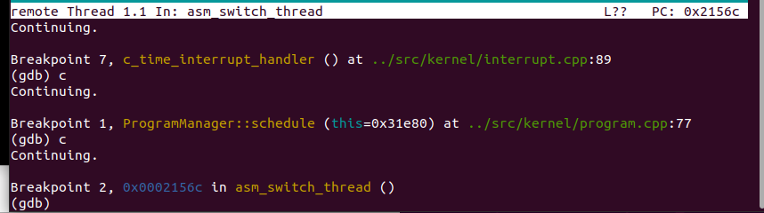

然后又是10次c_time_interrupt_handler函数，因为线程三里也有死循环，然后我们查看一下当前的寄存器

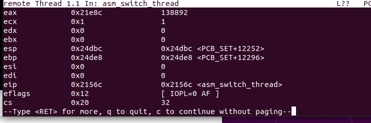

可以看到esp指向的0x24dbc，也就是第三页pcb，在经过asm_switch_thread函数后

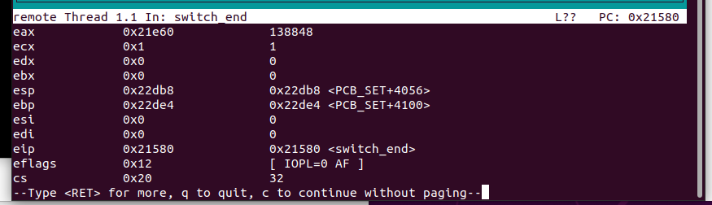

可以看到现在esp回到了0x22db8，也就是第一页的pcb，同时四个寄存器的值也进行了恢复，调用ret后将重新从线程1开始执行

**至此，这就是一个正在执行的线程是如何被中断然后被换下处理器的，以及换上处理机后又是如何从被中断点开始执行的。在执行的线程的现场会被保存到栈里面，栈的位置也会保存到pcb里面，在下一次调度到这个pcb的时候，通过pcb中栈指向的地方跳转回schedule函数，恢复中断，也就是还原了现场，可以让线程继续执行**

剩下的东西就一直是在线程1里死循环了，因为调用后中断了，中断后又在pcb中恢复，如此循环往复。


Assignment 4 调度算法的实现

所以这里我所做的改动是将线程的顺序用了抢占式的优先级调用，使得所有的线程顺序都按照优先级来输出

对于setup的进程进行改动，改变其优先级来，对输出来判断是否按照优先级输出而不是顺序输出

```c
int pid = programManager.executeThread(first_thread, nullptr, "first thread", 2);
    pid = programManager.executeThread(second_thread, nullptr, "second thread", 1);
    pid = programManager.executeThread(third_thread, nullptr, "third thread", 3);
```

其实一开始一直输出都是不按照优先级的，都是如下图的输出结果，就是明明优先级不同但是还是按照原来顺序进行输出

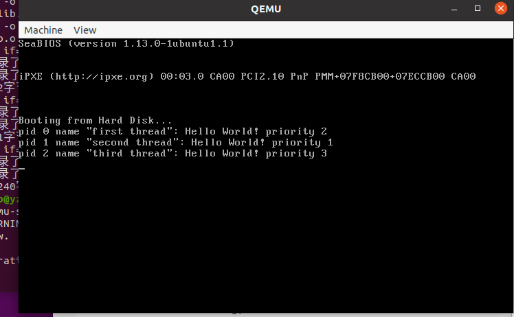

后来发现是在executeThread函数内未注释掉这样的一句话

```c
//readyPrograms.push_back(&(thread->tagInGeneralList));
```

导致我的readyprogram这个列表中一直出现了多次当前所创建的线程，所以在后面的排序等操作进行与不进行其实意义不大，所以还是得，所以在准备好的线程中开始读入的一直是当前的顺序，使得我后面对于线程在readylist内找位置的算法也只会找到他原来的位置的后面，因为这个位置已经有一个和他优先级一样的了，他也就放在了这个线程的后面。

注释掉这句话之后运行结果如下

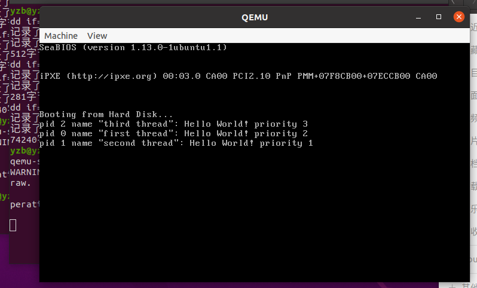

可以看到运行的顺序按照了优先级进行排序，实验成功。

也可以像实验2中用新建的pcb中的两个参数进行优先级调用，就需要改动一下生成线程函数的一些变量，比较方便，结果如下图


## 实验总结

本次实验主要涉及的是两个方面，首先是printf函数的实现，涉及到的知识点是关于含有可变参数的函数的实现与使用了，调用也就是定义了一个缓冲区，然后对开始的字符进行fmt的解析，将解析后的字符放入缓冲区中，如果缓冲区满了就输出，具体放入缓冲区还是等待还要进行判断，让我自己来写的话也就是调用封装好的这些函数进行一点优化和改动了。

更大的一个部分是关于线程的部分，本次实验中，尤其是第三个实验通过gdb调试让我更清楚地认识到了线程调度，保留现场，还原现场继续执行的过程，一个线程从开始调用，然后通过asm_switch_thread函数来使得esp指向被分配的pcb地址，然后对使用的四个寄存器进行初始赋值为0，然后通过ret进行跳转esp指向的地址，也就是线程程序，充分保证了线程执行的独立性，不会对其他线程进行影响和干预，同时保存到栈里的地址还可以进行恢复数据的操作使得没有执行完的线程继续执行。esp的值的变化一直是分配的一页pcb的大小，然后四个寄存器也都在单个线程中变化，同时单纯的中断出来和通过exit函数出来也有所不同，具体都在线程的实现过程中，让我对线程有了更大的了解。

最后的实验主要是在对于线程的readyProgram这个列表进行操作了，其实有些取巧的意味，我是在开始创建线程的时候就通过一些比较参数来让readyProgram的序列进行一次相对有序的状态，然后就可以运用原来的schedule里的代码，也就是在优先级的情况下可以通过ticks来防止单个线程一直执行而无法被中断，然后我也加上了抢占性的代码，当然注释后就不再抢占了，后来发现对于这几个线程，因为会通过ticks来判断退出，抢占也有点没有必要了，但还是加上了这一段函数。

## 参考文献

https://e.gitee.com/code_sysu/repos/code_sysu/os2021-lab5/tree/master/tutorial

[https://zhuanlan.zhihu.com/p/97071815](https://gitee.com/link?target=https%3A%2F%2Fzhuanlan.zhihu.com%2Fp%2F97071815)

https://www.cnblogs.com/clover-toeic/p/3736748.html