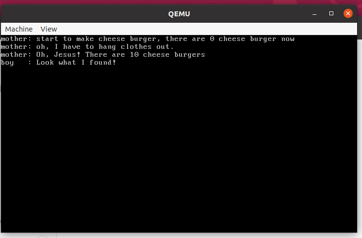
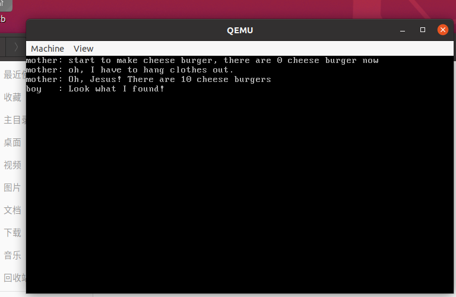
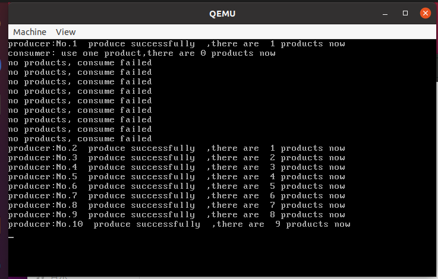
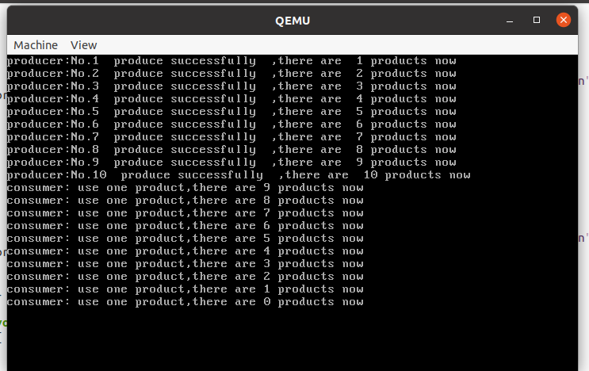
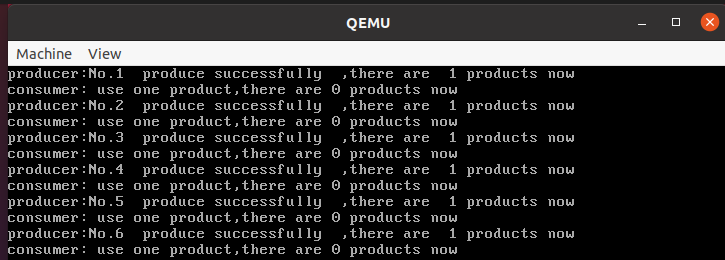
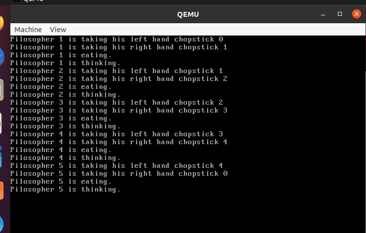
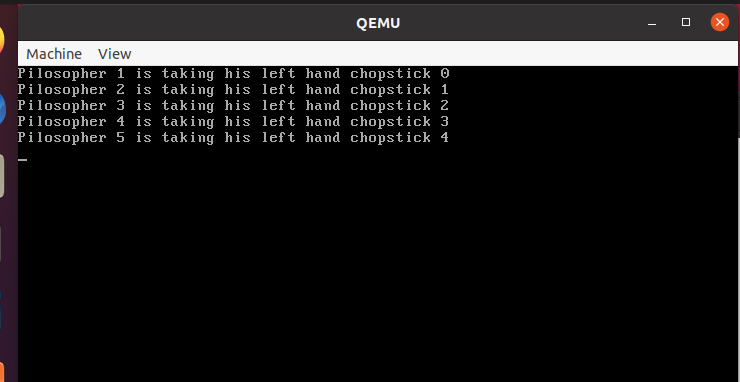
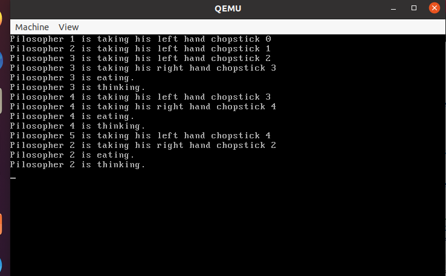

<font size =6>**操作系统原理 实验六**</font>

## 个人信息

【院系】计算机学院

【专业】计算机科学与技术

【学号】20337263

【姓名】   俞泽斌

## 实验题目

并发与锁机制

## 实验目的

1. 学习自旋锁以及使用自旋锁实现信号量，并在原子指令层面理解其实现过程。
1. 实现自定义的锁机制。
2. 学习使用信号量机制解决同步互斥问题。
2. 学习死锁的解决方法。

## 实验要求

1. 复现自旋锁和信号量机制。
2. 实现自定义的锁机制。
3. 掌握几种经典的同步互斥问题解决方法。
4. 撰写实验报告。

## 实验方案

Assignment 1 

1.2主要要求的是通过另外一个原子指令`bts`和`lock`前缀等，这些指令也可以用来实现锁机制。然后查阅资料得到bts的用法如下

*BTS*就是根据位偏移值从位串中取出一位放入*CF*中，然后将位串中的该位置成*1*。位基址可以为寄存器或内存寻址；位偏移值可以为寄存器或立即数

所以这里我采用了 lock bts的指令操作，因为在自旋锁的过程中就是通过不断交换key和bolt的值，当bolt为0的时候才结束循环并置1，那么在用lock bts进行实现的过程中，可以直接通过cf寄存器的值的判断来确定bolt的值，当bolt为1的时候cf始终为0，所以jc指令一直调用，就不改变key的值来返回，jc nend 只有在cf==1的时候，也就是bolt为0的时候不被调用，才可以为了结束循环将key的值置为0，跳出外面的while循环。

```
    mov eax,[ebp+4*2]
    ;取出arg1，也就是key
    mov ebx,[ebp+4*3]
    lock bts dword [ebx],0
    ;cf==1 的时候进位，所以可以用jc来判断
    jc nend
    mov dword[eax],0
    popad
    pop ebp
    ret
nend:
    popad
    pop ebp
    ret

```

Assignment 2

生产者与消费者问题主要的概念如下

生产者和消费者之间共享一个有界数据缓冲区，一个或多个生产者（线程或进程）向缓冲区放置数据，一个或多个消费者（线程或进程）从缓冲区取出数据。

在这里我采用的是单个生产者和单个消费者进行操作，生产者生产的过程中可能会出现没有生产就要消费的情况，那就会出现错误，这就需要锁的实现来改变这一种错误，我这里的生成者和消费者的实现的代码主要如图

```
void producer(void *arg)
{
    for(int i=0;i<10;++i){
    	product += 1;
    	printf("producer:No.%d  produce successfully  ,there are  %d products now\n",i+1, product);
    	int delay;
    	delay = 0xfffffff;
    	while (delay)
        	--delay;
    }
}

void consumer(void *arg)
{
    for(int i=0;i<10;++i){
    	if(product>0){
    		product -=1;
    		printf("consumer: use one product,there are %d products now\n",product);
    	}
    	else{
    		printf("no products, consume failed\n");
    	} 	
    }
}
```

这样就会出现没有生产出来却被消费的情况，即会出现错误，所以就需要引入信号量

在生产者写入前，通过 P 操作，使得当前只有一个线程能够进入临界区，这样避免了生产者未完成便被消费者消费的问题，具体代码如下

```
void producer(void *arg)
{   
    for(int i=0;i<10;++i){
    	if(product==0){
        semaphore.P(); 
    	product += 1;
    	printf("producer:No.%d  produce successfully  ,there are  %d products now\n",i+1, product);	
    	int delay;
    	delay = 0xffffff;
    	while (delay)
        	--delay;
    	semaphore.V();
    	}
    	else{
    	product += 1;
    	printf("producer:No.%d  produce successfully  ,there are  %d products now\n",i+1, product);
    	} 	
    }  
}
void consumer(void *arg)
{    
    for(int i=0;i<10;++i){
    	if(product>0){
    		product -=1;
    		printf("consumer: use one product,there are %d products now\n",product);
    	}
    	else{
    		printf("no products, consume failed\n");    		
    	} 	    	
    }    
}
```

这样就可以使得product在消费之前会被生成出来，也就是在product=0的时候的生产会加上锁，保证没有的情况下先生产。

Assignment 3

哲学家问题，先给出一个正常的情况，也就是按照正常的一个线程一个线程地调度，一个哲学家一个哲学家地吃饭这样来操作，具体实现线程如下代码：

```c++
Semaphore chopstick[5];
int ck[5];
void philosopher(void* arg)
{
    int num=*(int*)(arg);
    chopstick[num].P();
    if(ck[num]==0){
    	printf("Pilosopher %d is taking his left hand chopstick %d \n",num+1,num);
    	ck[num]=1;
    }
    else{
        printf(" left hand chopstick busy \n");
    }
    

    chopstick[(num+1)%5].P();
    if(ck[(num+1)%5]==0){
    	printf("Pilosopher %d is taking his right hand chopstick %d \n",num+1,(num+1)%5);
    	printf("Pilosopher %d is eating.\n",num+1);
    	ck[(num+1)%5]=1;
    	ck[(num+1)%5]=0;
        ck[num]=0;
        chopstick[num].V();
    chopstick[(num+1)%5].V();
    }
    else{
        printf(" right hand chopstick busy \n");
    } 
    //printf("Pilosopher %d is taking his right hand chopstick %d \n",num+1,(num+1)%5);
    //printf("Pilosopher %d is eating.\n",num+1);
    printf("Pilosopher %d is thinking.\n",num+1);      
}
```

这样的操作因为没有延迟的情况，所以哲学家可以一个一个的都拿起两双筷子吃饭，就不会产生死锁

下面写上一个死锁的情况，也就是在哲学家拿起左边的筷子的时候进行一次延迟，使得调度到下一个哲学家他又开始拿起左边的筷子，所有哲学家都拿起了左边的筷子，使得整个进程发生死锁。具体代码如下（复制一些局部防止冗余）

```c++
if(ck[num]==0){
    	printf("Pilosopher %d is taking his left hand chopstick %d \n",num+1,num);
    	ck[num]=1;
    }
    else{
        printf(" left hand chopstick busy \n");
    }
    
    int delay=0x8ffffff;
    while(delay)
         delay--;
    chopstick[(num+1)%5].P();
    if(ck[(num+1)%5]==0){
    	printf("Pilosopher %d is taking his right hand chopstick %d \n",num+1,(num+1)%5);
    	printf("Pilosopher %d is eating.\n",num+1);
    	ck[(num+1)%5]=1;
    	ck[(num+1)%5]=0;
        ck[num]=0;
        chopstick[num].V();
    chopstick[(num+1)%5].V();
    }
```

接下来就是解决死锁的操作了，查阅资料得知，解决哲学家问题的死锁的方式有许多，比如：

1、最多只有四个人能拿到筷子

2、对每个人标号，奇数拿左边的筷子，偶数拿右边的筷子

3、对于每一个哲学家，要么不拿，要么直接拿两个筷子开始吃饭

我这里采用的主要是第一种实现方式，也就是最多只有四个人能拿到筷子，所以我用了一个大小为4的参数来实现

首先是关于信号量r的初始化

```c++
void first_thread(void *arg)
{
    // 第1个线程不可以返回
    stdio.moveCursor(0);
    for (int i = 0; i < 25 * 80; ++i)
        stdio.print(' ');
    stdio.moveCursor(0);
    for(int i=0;i<5;i++){
        chopstick[i].initialize(1);
        ck[i]=0;
    }
    r.initialize(4);
    int a[5]={0,1,2,3,4};
    programManager.executeThread(philosopher, (void*)(a), "first thread", 1);
    programManager.executeThread(philosopher, (void*)(a+1), "second thread", 1);
    programManager.executeThread(philosopher, (void*)(a+2), "third thread", 1);
    programManager.executeThread(philosopher, (void*)(a+3), "fourth thread", 1);
    programManager.executeThread(philosopher, (void*)(a+4), "fifth thread", 1);
    asm_halt();
}
```

将信号量r初始化为4，也就是只有4个剩余资源，然后在进程的实现方面的代码，在每一次使用左边筷子时候对信号量进行操作。

```c++
Semaphore r;
void philosopher(void* arg)
{
    int num=*(int*)(arg);
    chopstick[num].P();
    if(ck[num]==0){
       r.P();
    	printf("Pilosopher %d is taking his left hand chopstick %d \n",num+1,num);
    	ck[num]=1;
    }
    else{
        printf(" left hand chopstick busy \n");
    }
    
    int delay=0x6ffffff;
    while(delay)
         delay--;
    chopstick[(num+1)%5].P();
    if(ck[(num+1)%5]==0){
    	printf("Pilosopher %d is taking his right hand chopstick %d \n",num+1,(num+1)%5);
    	printf("Pilosopher %d is eating.\n",num+1);
    	printf("Pilosopher %d is thinking.\n",num+1);
    	r.V();
    	ck[(num+1)%5]=1;
    	ck[(num+1)%5]=0;
        ck[num]=0;
        chopstick[num].V();
        chopstick[(num+1)%5].V();
    }
    else{
        printf(" right hand chopstick busy \n");
    }     
}
```

就可以解决哲学家问题的死锁问题

同时如果是第三种方法，那其实和没有加上延迟的第一次的代码一样，因为所做的操作就是让拿起左边的筷子和右边的筷子同步，所以也就只需做一些微调，如下

```c++
Semaphore chopstick[5];
int ck[5];
void philosopher(void* arg)
{
    int num=*(int*)(arg);
    chopstick[num].P();
    chopstick[(num+1)%5].P();
    if(ck[num]==0){
    	printf("Pilosopher %d is taking his left hand chopstick %d \n",num+1,num);
        printf("Pilosopher %d is taking his right hand chopstick %d \n",num+1,(num+1)%5);
    	printf("Pilosopher %d is eating.\n",num+1);
        chopstick[num].V();
        chopstick[(num+1)%5].V();
    }
    else{
        printf(" left hand chopstick busy \n");
        printf(" right hand chopstick busy \n");
    }   
    printf("Pilosopher %d is thinking.\n",num+1);      
}
```

就实现了哲学家问题的第二种解法，对于每一个哲学家，要么不拿，要么直接拿两个筷子开始吃饭。

## 实验过程

Assignment 1 



首先是1.1的复现，可以看到芝士汉堡在做完之后还是存在的，说明自旋锁实现成功

1.2这个实验上主要遇到的问题可能还是关于lock bts 这个原子指令的使用上，然后经过查询网上的有关资料找到了这个原子指令的具体功能：*BTS*就是根据位偏移值从位串中取出一位放入*CF*中，然后将位串中的该位置成*1*。位基址可以为寄存器或内存寻址；位偏移值可以为寄存器或立即数

找到具体功能后就是cf寄存器怎么读取的问题了，后来发现了jc这个指令，也就是Jump near if carry (CF=1).才通过jc和lock bts指令实现了对于bolt的判断和条件到了之后对于key的置位，实现结果也如下图



Assignment 2

这里主要涉及的是生成者和消费者问题，在2.1中我在生产者的过程中加入了延迟并没有加入锁的机制，使得在生产者生产的过程中因为延迟而调度到了消费者进程中，也就是说，在货物还没有生产出来的情况下进行了消费，也就产生了错误如下



2.2中引入了信号量的操作，在生产者写入前，通过 P 操作，使得当前只有一个线程能够进入临界区，在product=0的时候的生产会加上锁，保证没有的情况下先生产，就可以保证生产操作先进行



可以看到先保证了生产的操作，才会进行消费，也可以一个生产完就消费一个，具体都可以通过改变生产者和消费者的具体进程来实现，如下图的生产与消费过程，只要有产品就可以进行消费。



Assignment 3

3.1

首先是没有延迟的，也就是没有死锁状态的，也可以说是死锁状态的第三种解法，就是对于每一个哲学家，要么不拿筷子，要么直接拿两双筷子来吃饭



可以看到每一个哲学家都是拿到了两双筷子之后开始吃饭，然后接着到下一个哲学家。

3.2

为了实现死锁状态，我在哲学家拿起左筷子的过程中加上了延迟操作，使得拿起左筷子还没拿到右边的筷子的过程中就被调度到了下一个哲学家进程上，使得最后效果就是所有哲学家都拿着左边的筷子，进入死锁状态



3.3

为了让死锁状态解除，这里采用了两种解除操作

1、最多只有四个人能拿到筷子

2、对于每一个哲学家，要么不拿，要么直接拿两个筷子开始吃饭

对于第一种实现操作，就是加上了一个大小为4的信号量，并且在拿起左边筷子的时候对信号量进行P操作，然后对左右都拿到的情况下进行V操作，使得最多只有四个人能拿到筷子，运行结果如下



可以看到

第二种实现操作上来说与一开始的运行截图基本相同，也就是每个哲学家都通过相同的步骤得到筷子


所以综上，实验成功解决了哲学家问题的死锁。


## 实验总结

首先在本次实验中，我了解到了有关自旋锁的实现过程，也就是不断地通过while循环内的key和bolt的相互关系，并进行相互的交互，使得只有在bolt为0的时候才能使用临界区的资源，所以使得临界区的使用有了锁的限制，不会让多个进程不按照顺序的访问。

同时本次实验中引入了原子指令的操作，使得相同的指令被前后调用的时候尽最大可能地不相互影响，如本次实验中的xchg和lock bts两个指令，同时让我学了有关lock bts的有关操作，就是当后面的地址上的数为0的时候，取出并置为1，不然就将cf寄存器置1，并且了解到了jc的使用，可以调用cf寄存器里的内容。 

之后是关于死锁的方面，本次实验采用消失的芝士汉堡问题来作为例子，同时采用的生产者和消费者问题来锻炼，让我对线程调度有了更深刻的理解，同时对死锁的基本问题，生产者和消费者问题等问题有了理解，还有包括里面的读者写者以及后面的哲学家问题，在查阅资料的时候也有了理解。

关于锁的实现和死锁的解决方面，锁的实现本次实验采用了自旋锁和信号量的两种操作，信号量也用了自旋锁进行，定义一个非负整数counter表示临界资源的个数。当线程需要申请临界资源时，线程需要执行P操作，当线程释放临界资源时，线程需要执行V操作。

关于死锁的解决，在本次实验中也有了多的理解，比如通过锁的操作来让生产者的生产提前，包括后面哲学家问题里的三种解决死锁的方法：1、最多只有四个人能拿到筷子2、对每个人标号，奇数拿左边的筷子，偶数拿右边的筷子3、对于每一个哲学家，要么不拿，要么直接拿两个筷子开始吃饭。都让我对死锁的处理有了更充分的理解。

## 参考文献

https://blog.csdn.net/misterliwei/article/details/3950973?ops_request_misc=%257B%2522request%255Fid%2522%253A%2522165234487316782425113511%2522%252C%2522scm%2522%253A%252220140713.130102334..%2522%257D&request_id=165234487316782425113511&biz_id=0&utm_medium=distribute.pc_search_result.none-task-blog-2~all~sobaiduend~default-3-3950973-null-null.142^v9^control,157^v4^control&utm_term=bts&spm=1018.2226.3001.4187