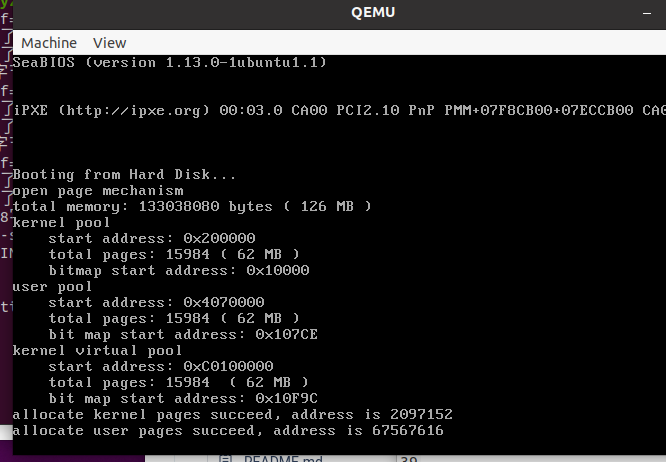

<font size =6>**操作系统原理 实验七**</font>

## 个人信息


【院系】计算机学院

【专业】计算机科学与技术

【学号】20337263

【姓名】   俞泽斌

## 实验题目

内存管理

## 实验目的

1. 实现二级分页机制，并能够在虚拟机地址空间中进行内存管理，包括内存的申请和释放等。
2. 实现动态分区算法。
3. 实现页面置换算法。
4. 掌握和实现虚拟内存管理技术。

## 实验要求

1. 实现二级分页机制，进行内存管理
2. 实现动态分区算法
3. 实现页面置换算法
4. 撰写实验报告。

##  实验方案

Assignment1

首先是关于位图的实现，位图主要就是来标识资源分配情况的位，需要手动划分出一块区域来存储BitMap用，具体的实现方式和代码都在tutorial中给出，主要的操作也就是在一些标志位中进行操作，分配了之后置1，没有分配就置0。

然后再往上面一层就是地址池，这个封装下可能就加上了分配的起始地址，能够打印出相关内容来判断分配资源的位置。

接下来是分开用户空间和内核空间，内核中的代码是在内核空间中运行的，编写的代码等是在用户空间内运行的。运行程序的时候会为可执行文件创建一个进程，然后执行代码，可执行文件的数据存放在操作系统为进程分配的空间中，而代码、数据和栈等存放的空间就是用户空间。具体的实现上就定义了一个类型AddressPoolType

所以剩下的就把所有的都合并起来为一个MemoryManager类，其中有两个地址池，分别为用户池和内核池。

二级页表的开启主要靠以下的几个操作

分页机制默认是关闭的，我们需要手动开启，启动分页机制的流程如下所示。

- 规划好页目录表和页表在内存中的位置，然后初始化。
- 将页目录表的地址写入cr3。
- 将cr0的PG位置1。

所以在在`src/kernel/memory.cpp`中实现openPageMechanism();具体代码也是在tutorial中给出了的，然后其中调用了汇编函数来写入cr3和将cr0的PG位置1，实现了二级页表的开启。

接下来就采用改动第一个线程first_thread的方式来分配两个页表，并且打印出他们的起始地址，然后释放，看看是否分配与释放成功。具体代码如下


具体操作间实验过程。

Assignment2

需要实现的是物理内存分配算法如first-fit, best-fit等实现动态分区算法，我这里实现的是best-fit 以及first-fit，首先我们来看分配物理页的代码

```c
int MemoryManager::allocatePhysicalPages(enum AddressPoolType type, const int count)下的 
start = kernelPhysical.allocate(count);
```

调用的是address_pool 里面的allocate函数，然后我们再往下找

```c++
int AddressPool::allocate(const int count)
{
    int start = resources.allocate(count);
    return (start == -1) ? -1 : (start * PAGE_SIZE + startAddress);
}
```

可以看到调用的是bitmap中的函数allocate

    int BitMap::allocate(const int count)
    {
        if (count == 0)
            return -1;
    int index, empty, start;
    index = 0;
    while (index < length)
    {
        // 越过已经分配的资源
        while (index < length && get(index))
            ++index;
        // 不存在连续的count个资源
        if (index == length)
            return -1;
        // 找到1个未分配的资源
        // 检查是否存在从index开始的连续count个资源
        empty = 0;
        start = index;
        while ((index < length) && (!get(index)) && (empty < count))
        {
            ++empty;
            ++index;
        }
        // 存在连续的count个资源
        if (empty == count)
        {
            for (int i = 0; i < count; ++i)
            {
                set(start + i, true);
            }
            return start;
        }
    }
    return -1;
    }
首先展示的是first-fit 的代码，也是教程中所给出的代码，主要的思想就是通过一个index变量来遍历整个资源位置，然后当找到一个比需要申请的空间大的地方就放入资源，并将位图中的位置都设为1

我同时实现了best-fit的代码

```c++
int BitMap::allocate(const int count){
  if (count < 0)return -1;
  int hole = 8 * length;
  int start1 = 0;
  bool empty = false;
  for (int i = 0; i < 8 * length; ++i){
    if (!get(i)){
      int temp1 = i;
      while (!get(i) && i < 8 * length)++i;   
      if (i == 8 * length && temp1 == 0){
        empty = true;
        break;
      }
      int tmp = i - temp1;
      if (tmp >= count){
        if (tmp < hole){
          start1 = temp1;
          hole = tmp;
        }
      }
    }
  }
  if (hole == length){
    if (!empty){
      return -1;
    }
    else{
      for (int i = 0; i < count; ++i)set(i, true);
      return start1;
    }
  }
  else{
    for (int i = 0; i < count; ++i){
      set(start1 + i, true);
    }
    return start1;
  }
  return -1;
}
```

具体思想就是遍历一遍整个位图，然后当找到一个比所需空间大的地方的时候，记录下首地址和与所需空间的差距大小，随后不断更新最短差距以及首地址，直至遍历完成，返回最小差值的首地址。

Assignment3

虚拟内存管理的页面置换算法如FIFO、LRU等，实现页面置换，也可以提出自己的算法。

首先理解一下页面置换算法的用途，是在所有帧都分配好了之后，需要使用一个新的页面，然后要把哪个页面移动回内存的问题，主要还是在于哪个页面这个的判断上，这里我实现的是FIFO以及LRU算法，具体操作首先自己定义一个类为页面交换类

```c++
class Pageswap{
public:
	int page[6];
	int size;
};
```

具体定义了一下自己当前资源所有的帧数，也就是同一时刻只能有6个页，然后先将所有的页面初始化为0，在调度的时候对于页面不断进行分配，具体的分配操作要看下面的代码

首先是FIFO

```c++
void FIFO(int x){
		int pos=findp(x);
		if(pos==-1){
			if(size<6){
				page[size++]=x;
			}
			else{
				for(int i=0;i<6;i++){
					page[i]=page[i+1];
					page[6]=x;
				}
			}
		}
		
		printf("FIFO: now pages in are  ");
		for(int i=0;i<6;++i){
			printf("%d",page[i]);	
		}
		printf("\n");
	}
```

FIFO算法，也就是先到先服务的算法，主要的操作就是用一个上面定义好的page的队列来存储有关的页面，因为每个页面调入的时候这个队列是由前往后扩张的，所以当整个队列满了的时候，也就是需要页面置换的时候，只需要将队列开始地址的那个页面调入内存，然后将其他的都往前移动一步即可。

然后是LRU

```c++
void LRU(int x){
		int pos=findp(x);
		if(pos==-1){
			if(size<6){
				page[size++]=x;
			}
			else{
				for(int i=0;i<6;i++){
					page[i]=page[i+1];
					page[6]=x;
				}
			}
		}
		else{
			for(int i=pos;i<5;++i){
				page[i]=page[i+1];				
			}
			page[5]=x;
		}
		printf("LRU: now pages in are  ");
		for(int i=0;i<6;++i){
			printf("%d",page[i]);	
		}
		printf("\n");
	}
```

LRU算法主要的是最近最少使用的思想，也是通过上述的队列的方式来实现，主要思想是先定义一个队列，然后如果队列没满且当前申请的页面不在队列内的话，就将当前申请的页面放到队列的最后端，如果队列满了，分两种情况，一种是当前页面不在队列内的情况，那就需要将队列的头调回内存了，然后将当前页面放入队列末端，队列其他项都向前一步，另一种情况是当前页面在队列里的情况，那只需要将当前页面放到队列末端，然后原本这个页面后面的那些页面都向前一步填补空缺。

这样就完成了两个页面调度算法的实现。

Assignment4

首先是关于虚拟页内存分配的三步过程，首先罗列一下所需的三步：

- **从虚拟地址池中分配若干连续的虚拟页**。
- **对每一个虚拟页，从物理地址池中分配1页**。
- **为虚拟页建立页目录项和页表项，使虚拟页内的地址经过分页机制变换到物理页内**。

这些步骤都在MemoryManager::allocatePages的函数中实现

第一步，分配虚拟页

```c++
int virtualAddress = allocateVirtualPages(type, count);
int allocateVirtualPages(enum AddressPoolType type, const int count)
{
    int start = -1;

    if (type == AddressPoolType::KERNEL)
    {
        start = kernelVrirtual.allocate(count);
    }

    return (start == -1) ? 0 : start;
}
```

第二步，分配物理页

```c++
physicalPageAddress = allocatePhysicalPages(type, 1);
```

第三步：为虚拟页建立页目录项和页表项，使虚拟页内的地址经过分页机制变换到物理页内。

```
flag = connectPhysicalVirtualPage(vaddress, physicalPageAddress);
bool MemoryManager::connectPhysicalVirtualPage(const int virtualAddress, const int physicalPageAddress)
{
    // 计算虚拟地址对应的页目录项和页表项
    int *pde = (int *)toPDE(virtualAddress);
    int *pte = (int *)toPTE(virtualAddress);

    // 页目录项无对应的页表，先分配一个页表
    if(!(*pde & 0x00000001)) 
    {
        // 从内核物理地址空间中分配一个页表
        int page = allocatePhysicalPages(AddressPoolType::KERNEL, 1);
        if (!page)
            return false;

        // 使页目录项指向页表
        *pde = page | 0x7;
        // 初始化页表
        char *pagePtr = (char *)(((int)pte) & 0xfffff000);
        memset(pagePtr, 0, PAGE_SIZE);
    }

    // 使页表项指向物理页
    *pte = physicalPageAddress | 0x7;

    return true;
}
```

然后加上意外情况的处理操作

```
if (!flag)
        {
            // 前i个页表已经指定了物理页
            releasePages(type, virtualAddress, i);
            // 剩余的页表未指定物理页
            releaseVirtualPages(type, virtualAddress + i * PAGE_SIZE, count - i);
            return 0;
        }
    }
```

就实现了虚拟页的内存分配，接下来是虚拟页内存释放

虚拟页内存释放主要是因为在分配页内存时，如果遇到物理页无法分配的情况，之前成功分配的虚拟页和物理页都要释放。否则就会造成内存泄漏，这部分内存无法再被分配。

主要的操作分两个步骤完成。

- 对每一个虚拟页，释放为其分配的物理页。

  ```
  int MemoryManager::vaddr2paddr(int vaddr)
  {
      int *pte = (int *)toPTE(vaddr);
      int page = (*pte) & 0xfffff000;
      int offset = vaddr & 0xfff;
      return (page + offset);
  }
  ```

- 释放虚拟页。

```
void MemoryManager::releaseVirtualPages(enum AddressPoolType type, const int vaddr, const int count)
{
    if (type == AddressPoolType::KERNEL)
    {
        kernelVirtual.release(vaddr, count);
    }
}
```

构造测试例子来分析虚拟页内存管理的实现是否存在bug。如果存在，则尝试修复并再次测试。这一部分就放到实验过程栏下


## 实验过程

Assignment1

分页的实现主要还是体现在对于tutorial的理解上，主要也就是采用了汇编代码的形式来完成其中打开分页的三个步骤，

- 规划好页目录表和页表在内存中的位置，然后初始化。
- 将页目录表的地址写入cr3。
- 将cr0的PG位置1。

函数如果能正确返回，则说明CPU能够正确使用分页机制来寻址。

我这里采用了对第一个线程中来分配物理地址和释放物理地址的过程来看是否实现成功



可以看到分配地址成功，并输出了开始位置的地址。说明对于分配和释放函数，分页机制是可以实现并使用的，说明分页实现成功。

Assignment2

首先是first-fit的动态分配算法，也就是对于一个新的要申请的内存，优先找到较为靠前的足够大的地方分配，为了展示相关效果，我将setup.cpp修改如下

    void first_thread(void *arg)
    {
        // 第1个线程不可以返回
    int p1 = memoryManager.allocatePhysicalPages(AddressPoolType::KERNEL, 10);
        printf("allocate first pages succeed, start_address is %d\n",p1);
    int p2 = memoryManager.allocatePhysicalPages(AddressPoolType::KERNEL, 40);
        printf("allocate second pages succeed, start_address is %d\n",p2);
    int p3 = memoryManager.allocatePhysicalPages(AddressPoolType::KERNEL, 10);
        printf("allocate third pages succeed, start_address is %d\n",p3);  
    int p4 = memoryManager.allocatePhysicalPages(AddressPoolType::KERNEL, 20);
        printf("allocate forth pages succeed, start_address is %d\n",p4);
    int p5 = memoryManager.allocatePhysicalPages(AddressPoolType::KERNEL, 10);
        printf("allocate fifth pages succeed, start_address is %d\n",p5); 
    memoryManager.releasePhysicalPages(AddressPoolType::KERNEL, p2, 40);
    memoryManager.releasePhysicalPages(AddressPoolType::KERNEL, p4, 20);
    int p6 = memoryManager.allocatePhysicalPages(AddressPoolType::KERNEL, 20);
        printf("allocate sixth pages succeed, start_address is %d\n",p6); 
    
    asm_halt();
    }
就是先分配5个内存，然后释放掉其中的两个，所以地址上会剩下两个孔，一个大小为40，较为靠前，一个大小为20，较为靠后，然后我们在申请一个大小为20 的内存，来看起始地址会是哪个孔的开始


可以看到第六个页分配的时候的起始地址是2138112，与第二页的地址相同，说明他分配到了第二页释放所留下来的地址上，说明first-fit函数实现成功。

接下来看best-fit，同样是上述的线程，如果是best-fit，因为第四页的释放所产生的内存大小正好够第六页来申请，所以应该看到的是第六页的起始地址与第四页的相同，接下来我们进行运行


可以看到第六页的起始地址与第四页的相同，与我们的预期吻合，所以best-fit 函数实现成功。

Assignment3

既然实现了两种页面调度算法，就将第一个线程修改如下

```c++
void first_thread(void *arg)
{
    Pageswap p1;
    for(int i=0;i<7;++i){
    	p1.LRU(i);
    }
    for(int i=7;i>0;--i){
    	p1.LRU(i);
    }
    Pageswap p2;
    for(int i=0;i<10;++i){
    	p2.FIFO(i);
    }

    asm_halt();
}
```

就是输入一串12345677654321的序列给LRU调度，并输入一串12345678910的序列给FIFO来调度

具体实验运行结果如下图


具体输出的是队列中的页面编号，可以看到LRU和FIFO的具体实现都成功。


Assignment4

构造测试例子来分析虚拟页内存管理的实现是否存在bug。如果存在，则尝试修复并再次测试。

采用一个简单的测试代码来看看分配后并释放掉的内存能不能访问找到

```c++
void first_thread(void *arg)
{
    char *p1 = (char *)memoryManager.allocatePages(AddressPoolType::KERNEL, 100);
    printf("allocate and not release %x\n", p1);
    memoryManager.releasePages(AddressPoolType::KERNEL, (int)p1, 10);
    printf("allocate and after release %x\n", p1); 
    asm_halt();
}
```


可以看到分配后不管释不释放，得到的地址都是C0100000，都是可以访问的，后来查阅资料得知是因为tlb未更新，所以刷新一下TLB，即在释放的末尾加上asm_init_page_reg((int*)PAGE_DIRECTOEY)这函数就可以得到准确的结果了。

并且所使用的MemoryManager为全局变量，容易被不同进程所使用的，导致错误，可以借助信号量来加上锁。

包括：主要工具安装使用过程及截图结果、程序过程中的操作步骤、测试数据、输入及输出说明、遇到的问题及解决情况、关键功能或操作的截图结果。不得抄袭，否则按作弊处理。

## 实验总结

首先，通过本次实验，一开始我学习了如何探查内存，在保护模式下无法使用15H中断的情况下，可以在实模式下调用中断获取内存大小，然后将内存大小写入一个固定的地址，最后在保护模式下读取到合适的位置，就可以输出内存大小。

其次，我学会了如何实现位图和地址池，会不断地对一些东西进行封装，来起到更好的表达效果，有了位图之后就可以很方便地利用它进行分页内存管理，并且实现二级分页机制，规划好页目录表和页表在内存中的位置，然后初始化。将页目录表的地址写入cr3。将cr0的PG位置1的操作来开启默认关闭的分页机制。并通过分页机制来快速访问到不同的内存地址。

同时，我还学习了对于内存的管理方面，具体是对于位图，地址池的封装，然后来管理物理内存，并学习和实践了物理内存分配算法如first-fit, best-fit，了解了计算机当分配不同内存的时候的决策策略以及相对应的好处和缺点

最后，我明白了虚拟页面管理的有关知识，虚拟地址是程序使用的地址，物理地址是CPU用来寻址的地址。虚拟空间中的虚拟地址是连续的，然后分配完虚拟地址和物理地址后要建立一个相对应的联系关系，从而方便地由虚拟地址访问到物理地址。其他的主要操作其实和 物理地址类似，包括分配与释放。

这次的算法主要是物理内存分配算法如first-fit，best-fit等算法、虚拟内存管理的页面置换算法如FIFO，LRU等算法的原理和实现，也让我学了很多。


## 参考文献

教程https://e.gitee.com/code_sysu/repos/code_sysu/os2021-lab7/tree/master/tutorial

页面置换算法https://blog.csdn.net/qq_43550476/article/details/111773769?ops_request_misc=%257B%2522request%255Fid%2522%253A%2522165390888616781818778259%2522%252C%2522scm%2522%253A%252220140713.130102334..%2522%257D&request_id=165390888616781818778259&biz_id=0&utm_medium=distribute.pc_search_result.none-task-blog-2~all~top_positive~default-2-111773769-null-null.142^v11^control,157^v12^control&utm_term=%E9%A1%B5%E9%9D%A2%E7%BD%AE%E6%8D%A2%E7%AE%97%E6%B3%95&spm=1018.2226.3001.4187