<font size =6>**操作系统原理 实验八**</font>

## 个人信息

【院系】计算机学院

【专业】计算机科学与技术

【学号】20337263

【姓名】   俞泽斌

## 实验题目

从内核态到用户态

## 实验目的

1. 理解区分内核态和用户态的必要性。
2. 编写一个系统调用，并分析系统调用前后栈的变化。
3. 掌握用户态与内核态之间切换的过程。
4. 掌握进程创建的过程。
5. 分析fork/exit/wait指令执行过程。
6. 学习如何通过分页机制隔离进程间的地址空间。

## 实验要求

1. 编写一个系统调用。
2. 掌握用户态与内核态之间切换的过程。
3. 实现fork/exit/wait指令。
3. 实现进程之间的隔离。
4. 撰写实验报告。

##  实验方案

Assignment1

首先系统调用是通过中断来实现的从低特权级转向高特权级的调用操作，操作系统为了限制程序访问特权资源，于是将程序的执行限制在特权级3下，称为用户态，而本次实验中的操作需要输出一些数据，所以需要写入显存，用户模式的特权级为3而将字符串写入显存需要0特权级，所以需要通过中断的方式来调用。

系统调用的中断向量号为80h，需要用到汇编的代码，而我们的内核包括后面的线程之类的都用了C的写法，所以我们这里需要对于系统调用的中断以及把参数压栈之类的操作进行汇编的封装，`asm_system_call`就是通过汇编来实现的封装函数。

然后创建一个管理系统调用的类`SystemService`，对系统调用表进行初始化，加入0x80中断对应的中断描述符，`asm_system_call_handler`是0x80号中断的处理函数，也会在调用int 10h的时候使用，来修改特权级，至此，从低特权级转向高特权级的的操作完成。

接下来是进程的创建方面，首先他需要一些准备工作，因为每一个进程都会有属于自己的页目录表和页表，而当进程在运行的时候，很有可能便会使用内核的数据结构，所以，对每一个进程，我们单独地划分出3~4GB的虚拟地址空间来作为共享的内核区域。然后通过分页机制，巧妙地将这部分虚拟地址变换到和虚拟地址0~1MB相同的物理地址上，从而使得进程也能访问到内核的资源。

其次，虽然内核的变量被提升到了3GB以上的空间，但我们实际上加载内核还是加载到`0x20000`处，只不过我们通过了分页机制将3GB以上的虚拟地址空间映射到0~1MB的空间。因此，为了能够让CPU能够正确寻址，我们需要在跳转到内核之前就开启分页机制

最后，由于进程的运行环境需要用到TSS、特权级3下的平坦模式代码段和数据段描述符，由于TSS的作用仅限于提供0特权级下的栈指针和栈段选择子，因此我们关心`TSS::ss0`和`TSS::esp0`。但在这里我们只对`TSS::ss0`进行复制，`TSS::esp0`会在进程切换时更新。

后面就来到了进程创建的方面了，进程的创建分为3步。

- 创建进程的PCB。
- 初始化进程的页目录表。
- 初始化进程的虚拟地址池。

但是其中会涉及的到高特权级向低特权级转移，实现高特权级向低特权级转移的唯一办法就是通过中断返回。我们可以通过`iret`指令强制将低特权级下的段选择子和栈送入段寄存器，从而实现了从高特权级别向低特权级转移，然后跳转到用户进程所在地址处执行。因此，在启动进程之前，我们需要将进程需要的段选择子等信息放入栈中。

进程的调度只需要在原先的线程调度的基础上加入如下部份。

- 切换页目录表。
- 更新TSS中的特权级0的栈。

这样就实现了基本的系统调用过程。

展现系统调用执行结果的正确性，结果截图并并说说你的实现思路。

其实这里的具体代码tutorial里已经给的很清楚了，我这里具体加上了一个新的系统调用函数，然后定义一个新的进程来调用，在原本的第一个系统调用后来输出具体代码如下

```c
int syscall_1()
{
    printf("hello\n");
    return 0;
}
void second_process()
{
    asm_system_call(1);
    asm_halt();
}
void first_thread(void *arg)
{
    printf("start process\n");
    programManager.executeProcess((const char *)first_process, 1);
    programManager.executeProcess((const char *)first_process, 1);
    programManager.executeProcess((const char *)first_process, 1);
    programManager.executeProcess((const char *)second_process, 1);
    asm_halt();
}
```

最后在开始的setup_kernel()函数中加入systemService.setSystemCall(1,(int)syscall_1);就完成了一次基本的系统调用。具体的栈以及寄存器的变化会在实验过程中做进一步的阐述

Assignment2

fork的实现可以细化为4个问题的解决。

1. 如何实现父子进程的代码段共享？
2. 如何使得父子进程从相同的返回点开始执行？
3. 除代码段外，进程包含的资源有哪些？
4. 如何实现进程的资源在进程之间的复制？

我们首先回答第三个问题——除代码段外，进程包含的资源有哪些？在我们的操作系统中，进程包含的资源有0特权级栈，PCB、虚拟地址池、页目录表、页表及其指向的物理页。

对于第二个问题，`ProgramStartProcess`中保存了父进程的`eip`，`eip`的内容也是`asm_system_call_handler`的返回地址。我们会通过`asm_start_process`来启动子进程。此时，`asm_start_process`的最后的`iret`会将上面说到的保存在0特权级栈的`eip`的内容送入到`eip`中。执行完`eip`后，子进程便可以从父进程的返回点处开始执行，即`asm_system_call_handler`的返回地址。这样父子进程的逐步返回的地址是相同的，就会从相同的返回点开始执行。

对于第一个问题，函数的代码是放在内核中的，进程又划分了3GB~4GB的空间来实现内核共享，因此进程的代码天然就是共享的

第四个问题，可以从内核中分配一页来作为数据复制的中转页，因为父子进程使用的是相同的代码。既然代码是相同的，则使用的虚拟地址也是相同的。二者不发生冲突的原因在于分页机制。由于分页机制实现了地址隔离，父进程就无法将数据复制到具有相同虚拟地址的子进程中。因此，我们需要借助于内核空间的中转页。我们首先在父进程的虚拟地址空间下将数据复制到中转页中，再切换到子进程的虚拟地址空间中，然后将中转页复制到子进程对应的位置。具体来说，就是先将父进程的页目录表复制到子进程中，然后我们复制页表和物理页的数据

所以综上我们实现了父进程和子进程的所有问题。关于gdb下具体的栈以及寄存器的变化会在实验过程中做进一步的阐述。

Assignment3

- 请结合代码逻辑和具体的实例来分析exit的执行过程。
- 请分析进程退出后能够隐式地调用exit和此时的exit返回值是0的原因。
- 请结合代码逻辑和具体的实例来分析wait的执行过程。
- 如果一个父进程先于子进程退出，那么子进程在退出之前会被称为孤儿进程。子进程在退出后，从状态被标记为`DEAD`开始到被回收，子进程会被称为僵尸进程。请对代码做出修改，实现回收僵尸进程的有效方法。

```c
void exit(int ret) {
  asm_system_call(3, ret);
}

void syscall_exit(int ret) {
  programManager.exit(ret);
}

int wait(int *retval) {
  return asm_system_call(4, (int)retval);
}

int syscall_wait(int *retval) {
  return programManager.wait(retval);
}
```

首先是exit和wait的具体实现函数，也是通过系统调用来实现的

我们来看具体的exit的代码

```c
void ProgramManager::exit(int ret) {
  interruptManager.disableInterrupt();

  PCB *program = this->running;
  program->retValue = ret;
  program->status = ProgramStatus::DEAD;

  int *pageDir, *page;
  int paddr;

  if (program->pageDirectoryAddress) {
    pageDir = (int *)program->pageDirectoryAddress;
    for (int i = 0; i < 768; ++i) {
      if (!(pageDir[i] & 0x1)) {
        continue;
      }

      page = (int *)(0xffc00000 + (i << 12));

      for (int j = 0; j < 1024; ++j) {
        if (!(page[j] & 0x1)) {
          continue;
        }

        paddr = memoryManager.vaddr2paddr((i << 22) + (j << 12));
        memoryManager.releasePhysicalPages(AddressPoolType::USER, paddr, 1);
      }

      paddr = memoryManager.vaddr2paddr((int)page);
      memoryManager.releasePhysicalPages(AddressPoolType::USER, paddr, 1);
    }

    memoryManager.releasePages(AddressPoolType::KERNEL, (int)pageDir, 1);

    int bitmapBytes = ceil(program->userVirtual.resources.length, 8);
    int bitmapPages = ceil(bitmapBytes, PAGE_SIZE);

    memoryManager.releasePages(AddressPoolType::KERNEL,
                               (int)program->userVirtual.resources.bitmap,
                               bitmapPages);
  }

  schedule();
}
```

这里开始就 标记PCB状态为`DEAD`并放入返回值，然后释放回收有关的内存的，就是如果他是进程的话就释放进程所占用的物理页、页表、页目录表和虚拟地址池bitmap的空间，不是就不做处理。

最后重新开始进程调度

接下来是wait的代码

```c
int ProgramManager::wait(int *retval) {
  PCB *child;
  ListItem *item;
  bool interrupt, flag;

  while (true) {
    interrupt = interruptManager.getInterruptStatus();
    interruptManager.disableInterrupt();

    item = this->allPrograms.head.next;

    flag = true;
    while (item) {
      child = ListItem2PCB(item, tagInAllList);
      if (child->parentPid == this->running->pid) {
        flag = false;
        if (child->status == ProgramStatus::DEAD) {
          break;
        }
      }
      item = item->next;
    }

    if (item) {
      if (retval) {
        *retval = child->retValue;
      }

      int pid = child->pid;
      this->allPrograms.erase(&(child->tagInAllList));
      interruptManager.setInterruptStatus(interrupt);
      return pid;
    } else {
      if (flag) {

        interruptManager.setInterruptStatus(interrupt);
        return -1;
      } else {
        interruptManager.setInterruptStatus(interrupt);
        schedule();
      }
    }
  }
}
```

主要的操作是寻找一个状态为 DEAD 的子进程，如果有，考虑是否需要保留返回值，如果不需要，那么直接返回即可，若需要，则要将返回值保存在 ` retval ` 所指向的内存中

如果找到的子进程状态不是 DEAD ，那么使用一个循环来让子进程阻塞，直到子进程退出。

具体实现步骤见实验过程


## 实验过程

Assignment1

- 请根据gdb来分析执行系统调用后的栈的变化情况。

首先修改gdbinit文件，加上对于first_process和 asm_system_call函数的断点，其实主要也就是为了在int 80h调用的前后观察寄存器的变化情况。

开始的时候当还是用户态的时候的esp和ss的具体情况如下

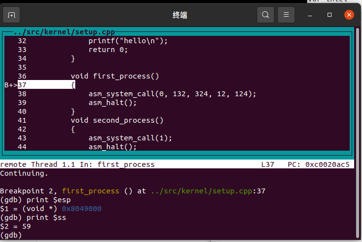

可以看到当前的esp值为0x8049000，当前的ss寄存器的值为59

然后通过gdb的单步调试功能，转到asm_system_call函数内的int 80h的操作

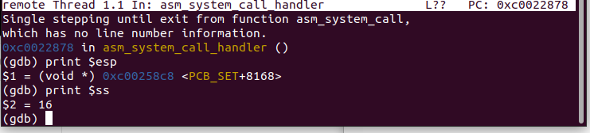

可以看到，当前esp寄存器的值以及来到了0xc00258c8，此时的ss寄存器也到了16的情况，esp的地址为当前内核的虚拟地址，说明已经成功进入了内核的模式，可以调用系统内核的操作。

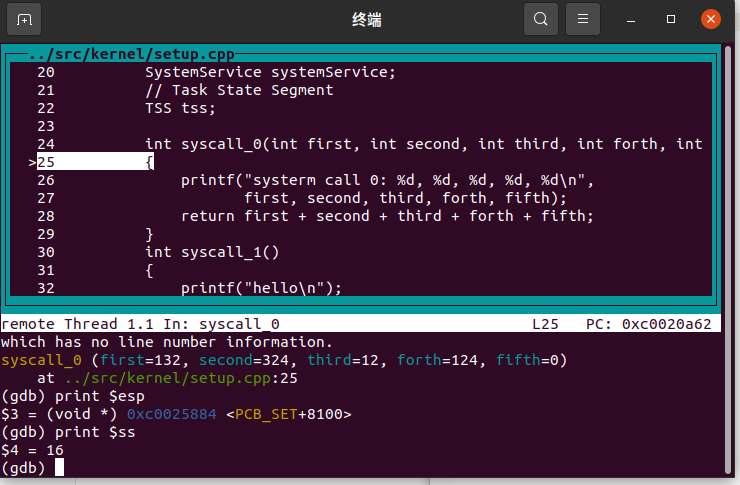

再经过一次单步调试，就发现来到了我们设置的系统调用函数，就是输出system call，然后就是具体调用printf函数方面的东西了，说明当前的系统调用功能成功。

请根据gdb来说明TSS在系统调用执行过程中的作用

TSS的作用仅限于为CPU提供0特权级栈所在的地址和段选择子

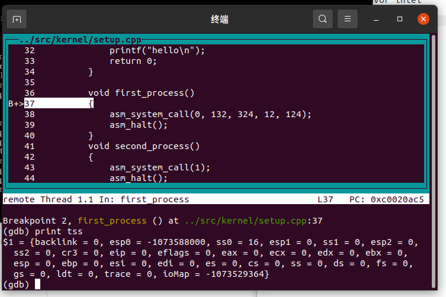

开始状态的tss，也就是用户态的时候，此时esp值为0x8049000


后面通过tss的指引，提供0特权级栈所在的地址和段选择子，使得当前的esp发生变化到内核态

Assignment2

- 从子进程第一次被调度执行时开始，逐步跟踪子进程的执行流程一直到子进程从`fork`返回，根据gdb来分析子进程的跳转地址、数据寄存器和段寄存器的变化。同时，比较上述过程和父进程执行完`ProgramManager::fork`后的返回过程的异同。

首先修改gdbinit文件如下

```c
target remote:1234
file ../build/kernel.o
set disassembly-flavor intel
b first_process
b asm_start_process
```

就是打上两个断点，使得程序在前面两个断点留下来

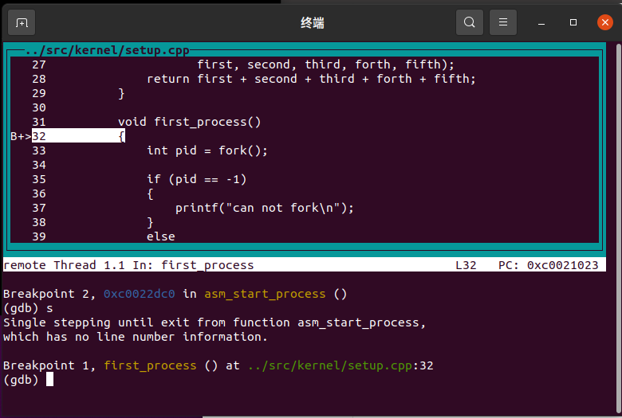

首先到达第一个进程的阶段，然后准备开始进入fork阶段

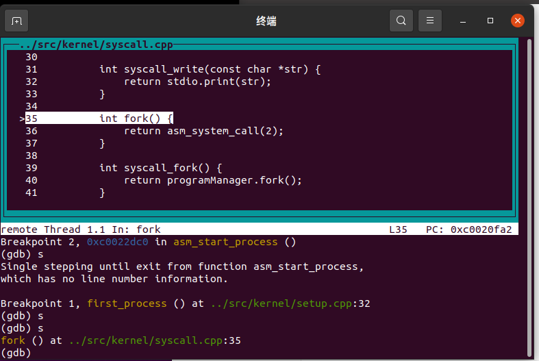

开始调用fork函数

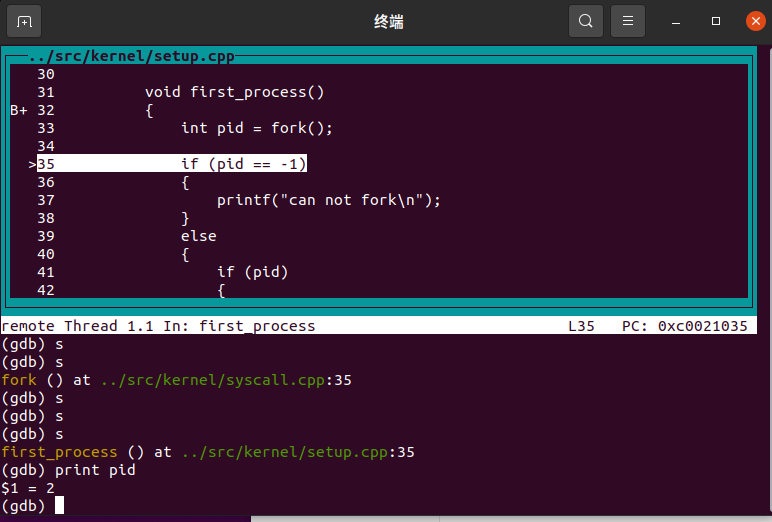

现在调用系统调用函数，然后第一次输出一下pid的值

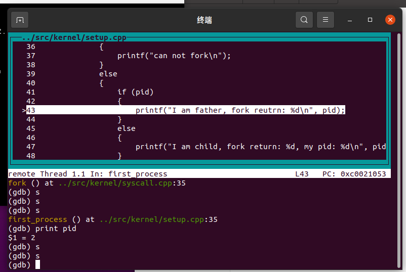

此时父进程开始输出，并且输出有关的pid

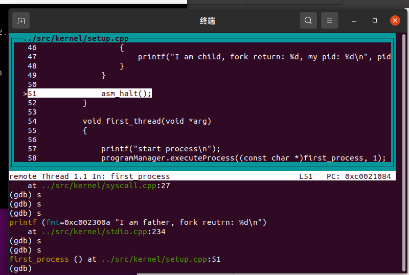

现在输出完成，开始调用asm_halt()来返回

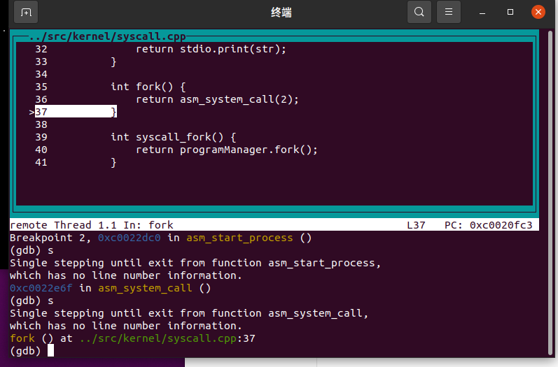

通过asm_system_call 重新进入fork函数，开始调用子进程

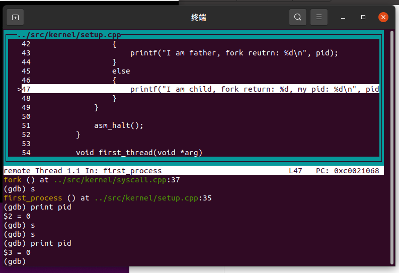

此时是子进程的操作，可以看到此时的pid为0，也就是当前子进程的返回值

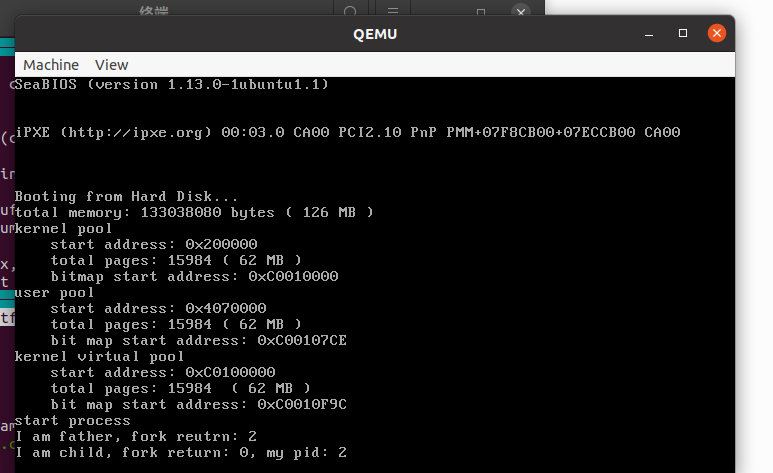

这就是最后的输出截图，可以看到完成了fork操作。

Assignment3

请结合代码逻辑和具体的实例来分析exit的执行过程。代码开始就 标记PCB状态为`DEAD`并放入返回值，然后释放回收有关的内存的，就是如果他是进程的话就释放进程所占用的物理页、页表、页目录表和虚拟地址池bitmap的空间，不是就不做处理。具体运行结果如下，exit执行成功。

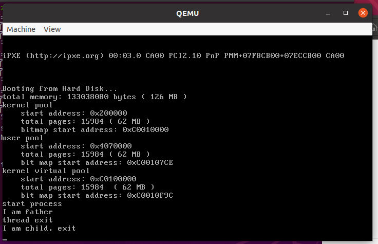


请分析进程退出后能够隐式地调用exit和此时的exit返回值是0的原因。

`exit(int ret)`函数的起始地址以及参数`ret`都放置在堆栈中，并且栈顶 是`userStack[0] = (int)exit`函数的返回地址

所以如果一个进程结束，他需要返回的时候，就会来栈里找栈顶，放入`eip`，从而隐式跳转到`void exit(int ret)`。

exit的返回地址是`userStack[1]`故返回值为0。


请结合代码逻辑和具体的实例来分析wait的执行过程。

见实验方案，主要的操作是寻找一个状态为 DEAD 的子进程，如果有，考虑是否需要保留返回值，如果不需要，那么直接返回即可，若需要，则要将返回值保存在 ` retval ` 所指向的内存中，具体运行结果如下图

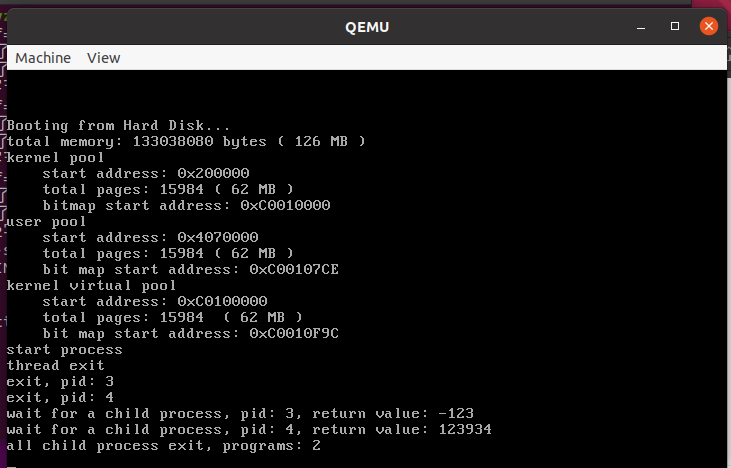

如果一个父进程先于子进程退出，那么子进程在退出之前会被称为孤儿进程。子进程在退出后，从状态被标记为`DEAD`开始到被回收，子进程会被称为僵尸进程。请对代码做出修改，实现回收僵尸进程的有效方法。

我这里使用的主要是在父进程中再调用一次wait的方法，首先修改第一个进程的代码如下

```c
void first_process()
{
    int pid = fork();
    int retval;
    if (pid) 
    {
        
        printf("father begin,running pid=%d\n",programManager.running->pid);
        wait(nullptr); 
        printf("father process exit\n");
    }
    else
    {	printf("son begin,running pid=%d\n",programManager.running->pid);
        printf("child process exit\n");
        exit(0);
    }
}
```

其中是有父进程和子进程，然后如果没有wait(nullptr); 这一行，也就是僵尸进程的情况运行结果如下

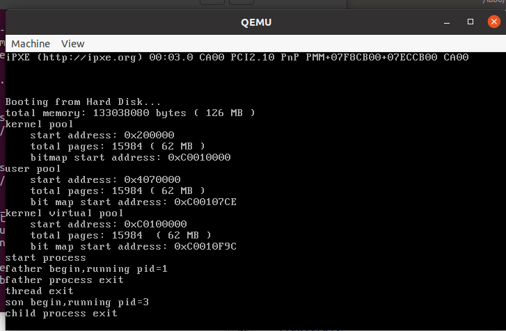

可以看到此时的父进程先于子进程退出，在子进程结束后没有调用exit函数来获取子进程的状态，得到了僵尸进程，修改后运行截图如下

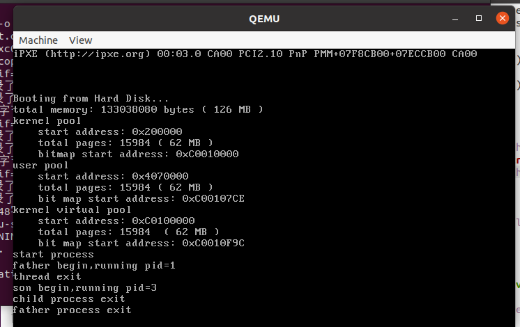

可以看到此时的父进程最后退出，并且调用了exit来获取子进程状态，所以 回收僵尸进程代码实现成功

思考题2：

找到这个具体的进程的代码如下

```c
PCB *ProgramManager::findProgramByPid(int pid) {
    return (PCB*)((int)PCB_SET+PCB_SIZE*pid);
}
```

此时pid相当于一个偏移量，可以通过pid和pcb_size 来方便地找到进程

当然也可以通过一遍遍历，来判断

```c
PCB *ProgramManager::findProgramByPid(int pid) {
	for (int i = 0; i < MAX_PROGRAM_AMOUNT; ++i) {
		if (((PCB *)((int)PCB_SET + PCB_SIZE * i))->pid == pid) {
			return (PCB *)((int)PCB_SET + PCB_SIZE * i);
			}
	}
}
```


## 实验总结

在这次实验中，首先我主要了解了有关特权级的知识，学习了保护模式下的特权级的相关内容。学习如何通过特权级保护，区分内核态和用户态，从而来保证资源的利用不冲突，然后我还学习了系统调用的方法，就是通过中断来实现由低特权级到高特权级转变以使用高特权级或者是通过使用`iret`指令实现从高特权级跳转到低特权级，也就是从内核态跳转到用户态的系统操作。接着是创建进程的有关知识，通过三步走的方法来创建进程，并且调度线程和进程。

然后是有关几个函数的方面了，这里我们主要学习的是fork，exit和wait函数，fork的关键在于资源的复制，将父进程的所有资源（除了`PCB`表之外）复制一份给子进程，还需要理解父进程与子进程执行完fork后的返回过程的异同，因为他们的返回值也不同，同时理解为何返回都回到同一条轨道上来。

之后是exit和wait函数，`exit`函数会释放进程处`PCB`表之外的所有资源，并且将进程的状态修改成`DEAD`，父进程会通过wait系统调用来等待其子进程执行完成并回收子进程，而如果父进程未能调用exit来读取子进程执行完后的状态，则子进程便成为一个僵尸进程，等待父进程将其释放。然后我这里的做法就是采用一个僵尸进程回收函数，在每一次需要进程调度的时候都调用回收函数，使得每次需要调度进程了都会检查文件中是否存在僵尸进程，使得子进程的pcb被系统回收，从而避免僵尸进程的产生。

## 参考文献

https://e.gitee.com/code_sysu/repos/code_sysu/os2021-lab8/tree/master/tutorial

https://blog.csdn.net/m0_46245582/article/details/122529140?ops_request_misc=%257B%2522request%255Fid%2522%253A%2522165482221116780366511988%2522%252C%2522scm%2522%253A%252220140713.130102334.pc%255Fall.%2522%257D&request_id=165482221116780366511988&biz_id=0&utm_medium=distribute.pc_search_result.none-task-blog-2~all~first_rank_ecpm_v1~rank_v31_ecpm-2-122529140-null-null.142^v12^control,157^v13^control&utm_term=%E8%A7%A3%E5%86%B3%E5%83%B5%E5%B0%B8%E8%BF%9B%E7%A8%8B%E7%9A%84%E5%8A%9E%E6%B3%95&spm=1018.2226.3001.4187